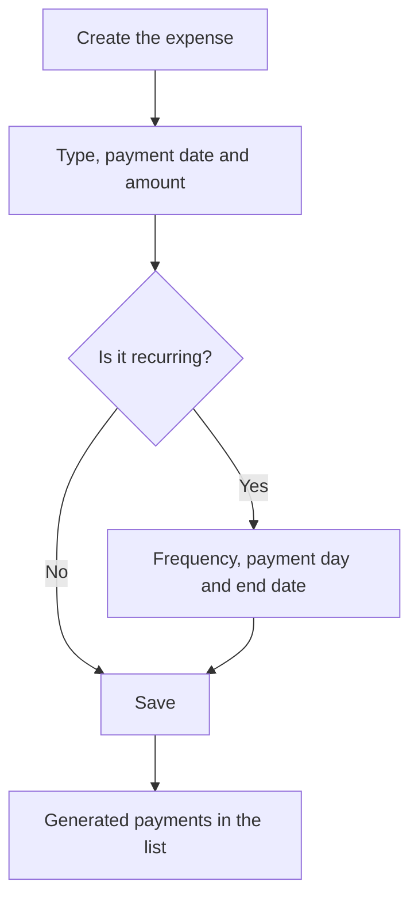

# Expense

## What this screen is for

This is the form of a general expense: a payment the company records outside purchase invoices, classified by type. It opens when you create an expense from "Expense management" ("New expense") or open an existing one ("Edit expense"). If the expense repeats, you set here how often and until when, and the application generates the future payments.

## Available actions

- Choose the expense "Type" and fill in the "Creation date", "Payment date" and "Amount".
- Tick "Recurring" to enable "Frequency", "Payment day" and "End date".
- Write a "Description".
- Save with "Save", in the screen header.

## Usual flow

1. From "Expense management", press "+".
2. Choose the "Type" and fill in the "Payment date" and "Amount".
3. For a periodic payment, tick "Recurring" and choose the "Frequency" (monthly, every two months, quarterly, half-yearly or yearly), the "Payment day" and the "End date".
4. Add a "Description" that identifies the payment.
5. Press "Save": you go back to the list, which now shows the expense and, if it is recurring, the generated payments.

## Important notes

- "Type", "Creation date", "Payment date" and "Amount" are required. Types are maintained in "Expense type management".
- The "Payment date" is the one that counts in the list and on the "Expense dashboard".
- When you create a recurring expense, the application generates a new payment for each "Frequency" period, with the same type, amount and description, up to and including the "End date". No generated payment goes past the end date.
- Generated payments always fall on the "Payment day" of each month. If the month is shorter (for example, day 31 in February), the last day of the month is used.
- When you edit a recurring expense, the expense you edit is saved and the payments after its payment date are generated again with the new data. Earlier payments do not change. To change the whole series, edit its first payment.
- Deleting a recurring expense from the list deletes the whole series.

## Common errors

- If "Save" does nothing, check the red messages: the type, a date or the amount is missing.
- If the "Type" dropdown is empty, go back to "Expense management" and open the expense from the list, which is what loads the types.
- If you ticked "Recurring", the form requires the "Frequency", a "Payment day" between 1 and 31, and an "End date" after the "Payment date". Check the red messages on those fields.
- If earlier payments did not change after editing a recurring expense, that is expected: only the following ones are regenerated. Edit the first payment of the series to change them all.

## Basic process

