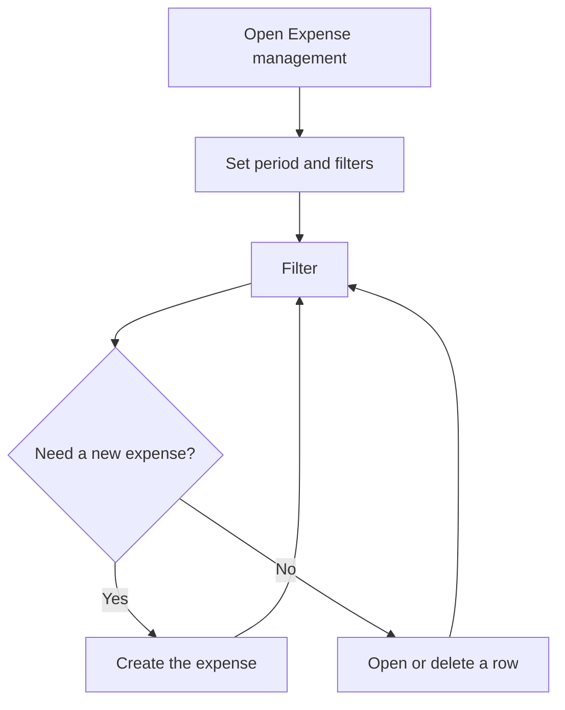

# Expense management

## What this screen is for

Lists the company's general expenses that are recorded outside purchase invoices, classified by expense type. For each expense you see the type, description, payment date, frequency and amount, with the period total at the foot of the column. These expenses feed the "Expense dashboard" and the comparative cash flow dashboard.

## Available actions

- Filter by "Period" (payment date), "Type" and "Frequency", and apply it with the "Filter" button.
- Go back to the initial filters with "Clear filters".
- Create an expense with the "+" button ("Create new").
- Open an expense by clicking its row to edit it.
- Delete an expense with the row's trash icon ("Delete"), after confirming.
- Sort by "Description" or "Payment date" by clicking the column header.

## Usual flow

1. Open "Expense management": the first time it shows the expenses with a payment date in the current year; after that, it restores the last filters you used.
2. Adjust the "Period" and, if needed, the "Type" or "Frequency", and press "Filter".
3. Check the total of the "Amount" column.
4. Press "+" to record a new expense, or click a row to correct it.
5. If an expense is not needed, delete it with the trash icon and confirm.

## Important notes

- The "Period" filters by payment date, not by creation date.
- Each payment of a recurring expense is a row of its own, with its own payment date.
- With "Frequency" set to "Not recurring" you only see one-off expenses.
- Filters are saved per user when you leave the screen. "Clear filters" goes back to the current year with no type or frequency.
- Deleting is permanent. If the expense is recurring, the whole series is deleted: the original expense and every generated payment, even if you only picked one.

## Common errors

- If an expense you just created is missing, check that its payment date falls within the "Period" and press "Filter".
- If other rows disappeared when you deleted a payment, the expense was recurring: the whole series was deleted and you will need to create it again.
- If the list is empty, check that the "Type" or "Frequency" filter is not too narrow.

## Basic process

