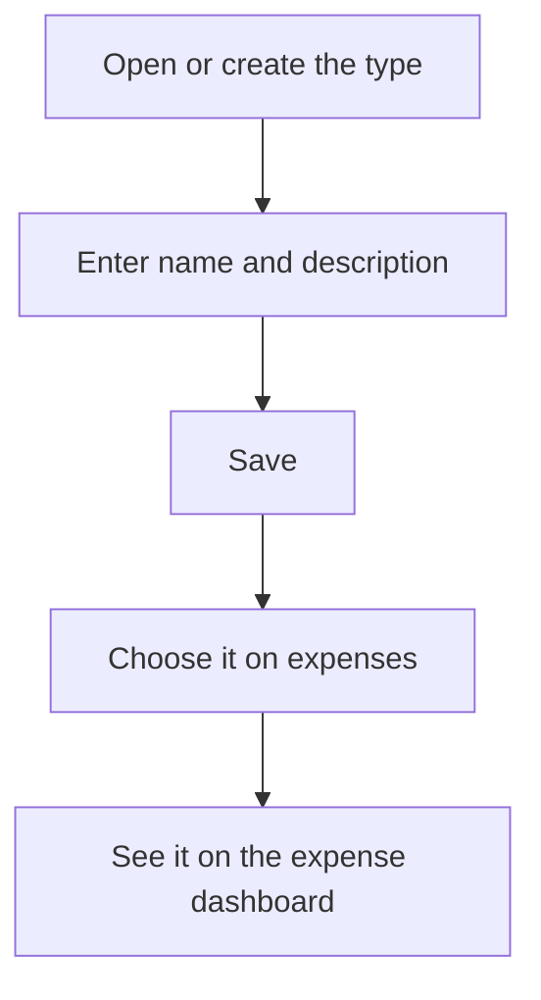

# Expense type

## What this screen is for

This is the form of an expense type. It opens when you create a type from "Expense type management" ("New expense type") or open an existing one. The name you enter is what you will pick in each expense's "Type" field and what you will see on the "Expense dashboard".

## Available actions

- Fill in the "Name" and the "Description".
- Tick or untick "Disabled".
- Save with "Save", in the screen header.

## Usual flow

1. From "Expense type management", press "+" or open an existing type.
2. Type a short, recognizable "Name": it is the label used in charts and filters.
3. Type a "Description" that explains which expenses belong to it.
4. Press "Save": a confirmation message appears and you go back to the list.

## Important notes

- "Name" and "Description" are required and accept up to 250 characters each. The name must be unique.
- Renaming a type affects all its expenses: on the "Expense dashboard" and the cash flow dashboard they appear under the new name.
- "Disabled" does not hide the type: it is still available in the expenses' "Type" field.
- A type is deleted from the list, and all its expenses are deleted with it (see the "Expense type management" help).

## Common errors

- If "Save" does nothing, check the red messages under the fields: the name or the description is missing.
- If "Entity already exists" appears, another type already has the same name.

## Basic process

