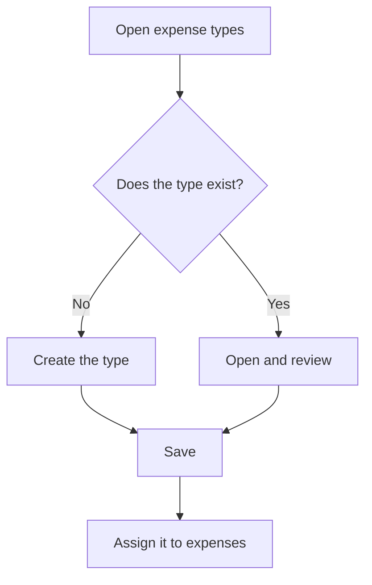

# Expense type management

## What this screen is for

Lists the expense types, the catalog that classifies the company's general expenses recorded in "Expense management", outside purchase invoices. Every expense in "Expense management" has a type, and the "Expense dashboard" groups expenses by type in its chart by type.

## Available actions

- Create a type with the "+" button ("Create new") above the list.
- Open a type by clicking its row to change its name, description or "Disabled".
- Delete a type with the row's trash icon ("Delete"), after confirming.

## Usual flow

1. Open "Expense type management".
2. Check the "Name" and "Description" columns to see whether the type you need already exists.
3. If it does not, press "+", fill in the name and description, and save with "Save".
4. Go to "Expense management" and use the new type in the expenses' "Type" field.

## Important notes

- Deleting an expense type permanently removes the type and also every expense assigned to it. Those expenses disappear from "Expense management", the "Expense dashboard" and the cash flow dashboard.
- The type name is what the "Expense dashboard" shows (the "Detail" filter and the chart by type) when the type is "Expense". If you rename it, existing expenses are shown under the new name.
- Marking a type "Disabled" is only an indication in the list: the type is still available in the expenses' "Type" dropdown and in the filters.
- The list has no filters: it always shows every type.

## Common errors

- Before deleting a type, check in "Expense management", filtering by that "Type" over a wide period, that it has no expenses you want to keep.
- If "Entity already exists" appears when creating it, a type with that name already exists.

## Basic process

