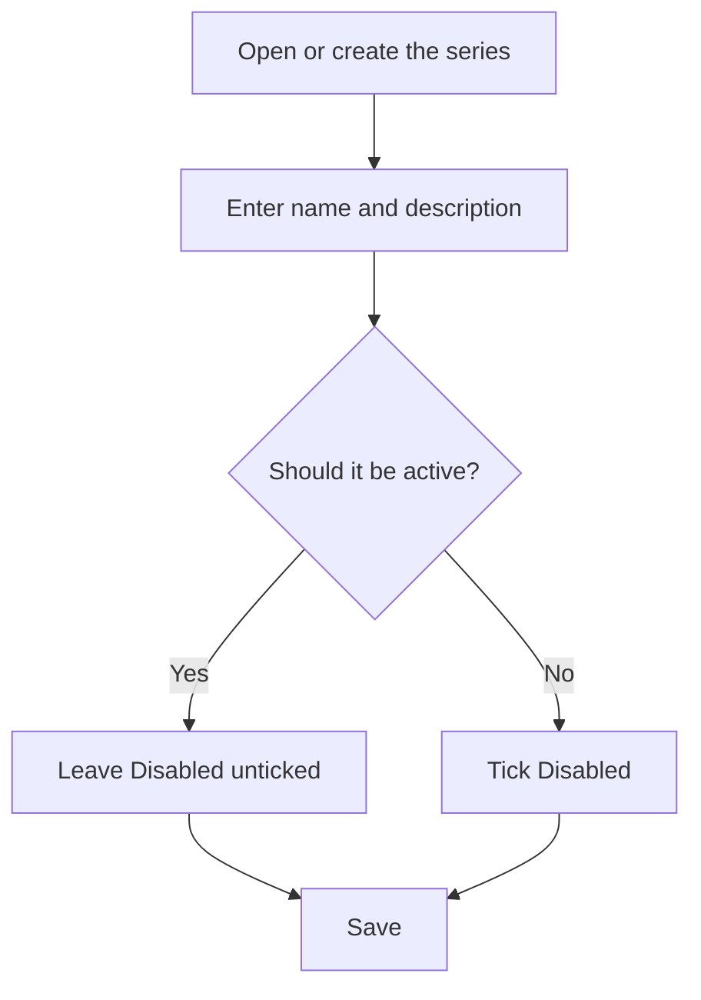

# Invoice series

## What this screen is for

This is the form of a purchase invoice series. Here you set the name you will pick in the purchase invoice's "Series" field, a description, and whether the series is active. It opens when you create a series from "Purchase invoice series" ("New invoice series") or open an existing one.

## Available actions

- Fill in the "Series name" and the "Description".
- Tick or untick "Disabled".
- Fill in "Prefix", "Suffix", "Next number" and "Length".
- Save with "Save", in the screen header.

## Usual flow

1. From "Purchase invoice series", press "+" or open an existing series.
2. Type the "Series name", which is what you will see in the invoice dropdown.
3. Type a "Description" that explains when the series should be used.
4. Leave "Disabled" unticked if the series must be selectable.
5. Press "Save": a confirmation message appears and you go back to the list.

## Important notes

- "Series name" and "Description" are required. The name accepts up to 50 characters and must be unique; the description, up to 250.
- "Prefix", "Suffix", "Next number" and "Length" are stored with the series, but they are not currently used to number purchase invoices. The invoice's internal number comes from the fiscal year's "Purchase invoices" counter ("Fiscal years" screen).
- Even so, the form requires "Next number" to be a positive whole number and "Length" a whole number between 1 and 20. "Prefix" and "Suffix" accept up to 10 characters.
- If you tick "Disabled", the series can no longer be chosen on purchase invoices, but invoices that already have it keep it.
- If the series is named "Nacional", new purchase invoices propose it by default. Renaming it stops that.

## Common errors

- If "Save" does nothing, check the red messages under the fields: usually the name or the description is missing.
- If "Entity already exists" appears, another series already has the same name.
- If the "Length" is rejected, it must be a whole number between 1 and 20.
- If the series does not appear on the purchase invoice after saving, check that "Disabled" is not ticked.

## Basic process

