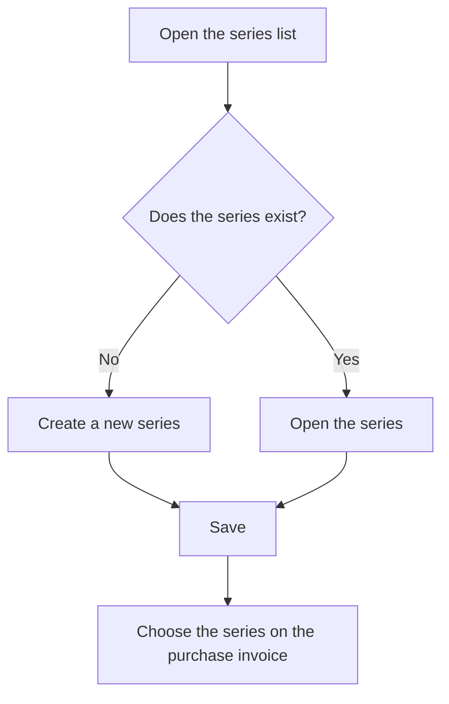

# Purchase invoice series

## What this screen is for

Lists the invoice series that can be assigned to purchase invoices. The series is the "Series" field of a purchase invoice and is used to classify it. From here you create new series, open existing ones to change them, and delete the ones you no longer need.

## Available actions

- Create a series with the "+" button ("Create new") above the list.
- Open a series by clicking its row to edit it on the "Invoice series" screen.
- Delete a series with the row's trash icon ("Delete"), after confirming.
- See at a glance which series are disabled in the "Disabled" column.

## Usual flow

1. Open "Purchase invoice series".
2. Check the "Series name" and "Description" columns to see whether the series you need already exists.
3. If it does not, press "+" and fill in the series form.
4. Save with "Save": you go back to the list, which now shows the new series.
5. When a series is no longer used, open it and tick "Disabled" instead of deleting it.

## Important notes

- The series does not number invoices. The purchase invoice's "Internal invoice no." comes from the "Purchase invoices" counter of the fiscal year that matches the invoice date ("Fiscal years" screen).
- New purchase invoices propose the series named "Nacional" by default, if it exists and is active.
- Series marked "Disabled" no longer appear in the purchase invoice's "Series" dropdown.
- Deleting a series removes it permanently. A series that is already assigned to purchase invoices cannot be deleted.
- This list has no filters: it always shows every series, active and disabled.

## Common errors

- If deleting fails, check whether the series has already been used on a purchase invoice; if so, disable it instead.
- If a series is missing from the invoice's "Series" dropdown, check that it is not marked "Disabled".
- If "Entity already exists" appears when creating it, a series with that name already exists: choose another name.

## Basic process

