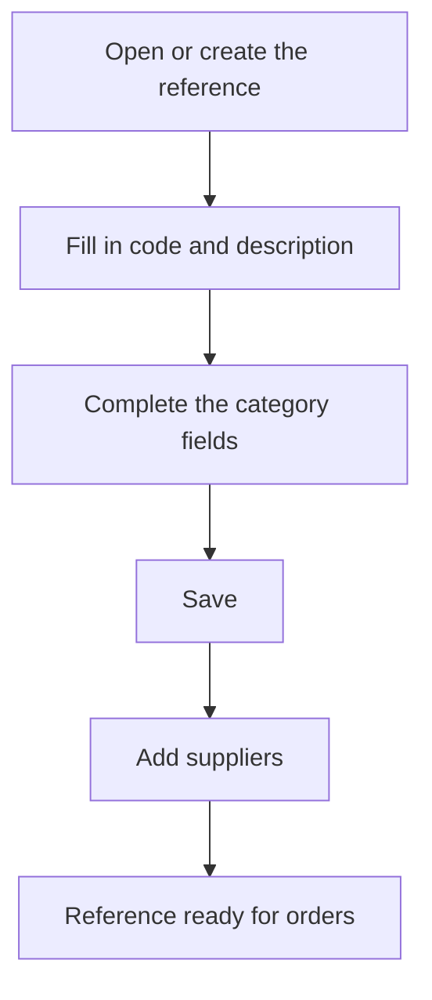

# Purchase reference

## What this screen is for

This is the record of a purchase reference: a material, a tool or a service. Here you define the data used by purchase orders and receipt delivery notes and, at the bottom, which suppliers provide it and on what terms. Searching and creating are done from the "Purchase references" screen.

## Available actions

- Fill in or change the reference's data and save it with "Save", in the screen header.
- Add a supplier to the "Suppliers" table with the "+" button, entering "Supplier", "Supplier code", "Supplier description", "Supplier price" and "Supply days".
- Edit a supplier's terms by clicking its row.
- Remove a supplier with the "X" on the row, after confirming.

## Usual flow

1. From "Purchase references", choose the category and press "+", or open an existing reference.
2. Fill in "Code" and "Description".
3. Complete the fields for the category: for a material, "Material type", "Format" and "Tax"; for a tool, "Tax" and "Production area"; for a service, "Service price" and "Transport price".
4. Press "Save".
5. In the "Suppliers" table, add the suppliers that provide it, with their price and supply days.

## Important notes

- The "Category" comes from the list you created the reference from and cannot be changed.
- "Code" (up to 50 characters) and "Description" (up to 250) are required in every category.
- Materials: "Material type", "Format" and "Tax" are required. On save, the code is automatically completed with the material type's name in parentheses.
- Materials: "Last cost" updates itself every time a receipt delivery note with this material is saved. Once the material has delivery notes, the field is locked.
- Tools: "Tax" and "Production area" are required, and the format is automatically set to units.
- Services: "Service price" and "Transport price" are required; "Tax" is optional.
- Materials and services have the "Disabled" checkbox.
- When you create a new reference you stay on the record so you can add suppliers; when you save an existing reference you go back to the previous screen.
- The "Suppliers" table holds the same data as the "References" tab on the supplier's record. When you add the reference to a purchase order for that supplier, its price, description and expected date (today plus the supply days) are proposed.

## Common errors

- If "The material already exists" appears when creating, the reference could not be created: check that you have not already saved it and reopen it from the list.
- If it does not save, check the messages under the category's required fields, for example "VAT is required" or "Format is required".
- If you cannot change "Last cost", the material already has receipt delivery notes and the cost is maintained from there.
- If "The reference already exists" appears when adding a supplier, that supplier is already listed: edit its row.

## Basic process

