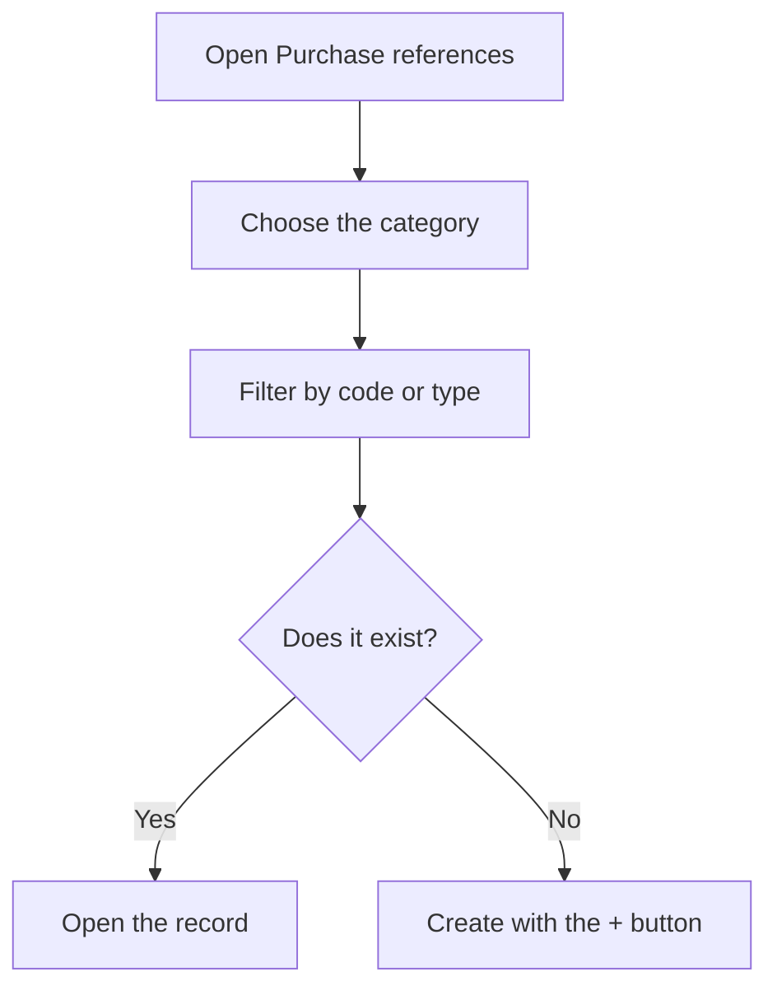

# Purchase references

## What this screen is for

This is the catalog of the references you buy: materials, tools and services. These are the references you choose on the lines of purchase orders and receipt delivery notes. From here you look them up by category, open each one's record, create new ones, or delete those that have not been used.

## Available actions

- Choose the "Category" (Material, Eina or Servei) to see its references.
- Search by "Code" and, in the Material category, filter by material "Type".
- Clear the code and type with "Clear".
- Create a reference in the selected category with the "+" button ("Create new").
- Open a reference's record by clicking the row.
- Delete a reference with the "X" on the row, after confirming.

## Usual flow

1. Open the "Purchase references" screen.
2. Choose the "Category" you want to see.
3. Type part of the code in "Code" or, for materials, pick a "Type".
4. Click the row to open the record and review or change it.
5. If the reference does not exist, press "+" and fill in the new record.

## Important notes

- With no category chosen, the list is empty.
- The categories are shown with their Catalan names: Material, Eina (tool) and Servei (service).
- The "Type" filter is only enabled for the Material category.
- The columns change with the category: materials show "Type", "Format" and "Density (mm)"; services show "Price" and "Transport"; tools show the "Area".
- The "+" button creates a reference in the category you have selected. Choose it before creating.
- When you come back to the screen, your last filters are restored.
- Deletion is permanent. Before deleting, the app checks whether the reference has dependencies, for example orders, receipt delivery notes, stock or lots, stock movements, a production route or work orders, or whether it is part of a bill of materials or a purchase rate. If it has any, it is not deleted.

## Common errors

- If the list is empty, check that you have chosen a "Category" and that the "Code" filter is not too narrow.
- If you cannot choose a "Type", switch the category to Material.
- If "Reference with dependencies:" appears when deleting, read the reasons listed: the reference has already been used and must be kept.

## Basic process

