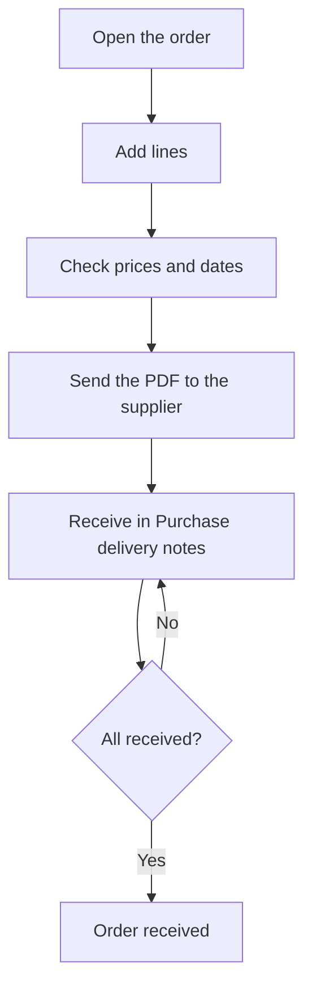

# Purchase order

## What this screen is for

This is the record of a purchase order to a supplier: the header with the financial year, date, status and supplier, and the lines with what is being ordered. It lets you follow how much of each line has been received and on which delivery note, and produce the order document to send to the supplier. Pending lines are received later in "Purchase delivery notes", the step before the purchase invoice.

## Available actions

- Change "Financial year", "Order date", "Status" and "Supplier" and save with "Save".
- Download the order document as a Word file with "Download", in the "Save" button's drop-down.
- Download the order as a PDF with "Print PDF", in the same drop-down.
- Add a line with the "+" button in "Purchase order detail".
- Change a line by clicking its row.
- Delete a line with the "X", after confirming.
- Expand a line with the arrow on the left to see its receipts: "Delivery note", "Quantity", "Date" and "User". The delivery note number opens the receipt delivery note.
- Open the reference's record with the link in the "Reference" column.

## Usual flow

1. Open the order from "Purchase orders", or right after creating it.
2. Press "+" in "Purchase order detail" and choose the "Purchase reference".
3. Check the proposed description, "Expected date" and "Price", enter the "Quantity" and press "Create".
4. Repeat for each line.
5. Download the order with "Print PDF" or "Download" to send it to the supplier.
6. When the goods arrive, record them in "Purchase delivery notes" with "Add from purchase order"; this order's "Received qty." column updates by itself.

## Important notes

- The "Number" is generated when the order is created and cannot be changed.
- The "Status" drop-down only offers the statuses you can move to from the current one, according to the purchase order lifecycle configured in "Lifecycles".
- Saving the header with "Save" takes you back to the previous screen.
- When you choose a line's reference, if the order's supplier has it among its references, its price, description and expected date (today plus the supply days) are proposed. If not, the price and description from the reference's record are proposed.
- The line's "Price" field is the total amount: quantity times unit price. For services, the price is not multiplied by the quantity. The "Unit price" is recalculated on save from the amount and the quantity.
- "Quantity" must be at least 1, and the reference and description are required.
- Once a line has a received quantity, its reference, quantity and price can no longer be changed, and the "X" to delete it disappears.
- When goods are received on a delivery note, the line's status changes automatically to partially received or received, depending on the quantity. When all lines are received, or all are cancelled, the order's status changes automatically.
- If a receipt is removed from a delivery note, the line's received quantity is reduced and its status is recalculated.
- Lines created from "Purchase order generation" stay linked to the work order phase.

## Common errors

- If the header does not save, check that "Financial year", "Order date", "Status" and "Supplier" are filled in.
- If "Quantity must be greater than 1" appears when creating a line, enter a quantity of 1 or more.
- If a line proposes no price or expected date, the supplier does not have that reference on the "References" tab of its record: add it there.
- If you cannot change a line's quantity or price, goods have already been received for that line.
- If "Could not generate the purchase order document" appears, try again or use "Print PDF".

## Basic process

