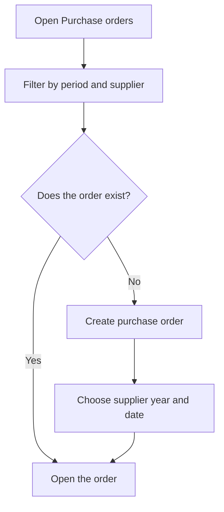

# Purchase orders

## What this screen is for

This screen lists the purchase orders placed with suppliers in a period. It is the first step of the purchasing flow: purchase order -> receipt delivery note -> purchase invoice. From here you find an order to follow it up, create a new one, or delete those that have not been processed yet.

## Available actions

- Filter by "Period" and "Supplier" and apply the filter with "Filter".
- Reset the filter with "Clear".
- Create an order with the "+" button ("Create new"): the "Create purchase order" dialog opens.
- Open an order by clicking the row.
- Delete an order with the "X" on the row, after confirming.

## Usual flow

1. Open the "Purchase orders" screen: the orders for the current year are shown.
2. Adjust the "Period" or choose a "Supplier" and press "Filter".
3. Click an order to see its lines and their receipt status.
4. To place a new order, press "+", choose "Supplier", "Financial year" and "Date", and press "Create".
5. The new order opens straight away so you can add its lines.

## Important notes

- When the screen opens, the period is the current year. "Clear" removes the supplier and sets the current year again.
- The list shows "Number", "Date", "Supplier" and "Status".
- The order number is assigned automatically from the counter of the chosen financial year; you do not type it.
- In the "Create purchase order" dialog, the "Financial year" defaults to the current year's if it is active.
- Every new order starts in the initial status of the purchase order lifecycle, configured in "Lifecycles".
- The "X" to delete only appears while the order is in its initial status. Deletion is permanent. If the order was generated from a work order phase, the phase becomes available again in "Purchase order generation".
- Orders can also be created automatically from "Purchase order generation", from the external phases of work orders.

## Common errors

- If "Select a period" appears, the period is incomplete: choose a start date and an end date.
- If you cannot find an order, check that its date is within the period and that the supplier filter is correct.
- If the "X" to delete does not appear, the order is no longer in its initial status.
- If the order cannot be created and "Exercise not found" or "Error creating counter" appears, check the chosen financial year and its purchase order counter.
- If a message says the lifecycle does not exist or has no initial status, the purchase order lifecycle needs to be reviewed in "Lifecycles".

## Basic process

