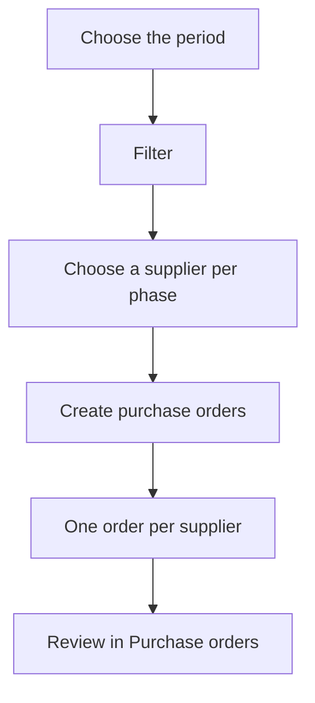

# Purchase order generation

## What this screen is for

This screen creates purchase orders from the external phases of work orders, that is, phases carried out by a supplier (for example, a treatment or a subcontracted service). You choose the supplier for each phase and the app creates the orders grouped by supplier. From there the flow continues like any purchase: purchase order -> receipt delivery note -> purchase invoice.

## Available actions

- Choose the "Period" and load the phases with "Filter".
- Reset the period to the current year with "Clear".
- Choose each phase's supplier in the drop-down in the "Supplier" column.
- Remove a phase's supplier with the drop-down's clear icon, so that it is not ordered.
- Create the orders for every phase with a supplier with "Create purchase orders".

## Usual flow

1. Open the "Purchase order generation" screen.
2. Check the "Period" and press "Filter" to load the pending phases.
3. For each phase you want to order, choose the supplier in the "Supplier" column.
4. Press "Create purchase orders".
5. When it finishes, the app takes you to "Purchase orders", where you will find the new orders to review and send.

## Important notes

- The list does not load by itself: you need to press "Filter". When the screen opens, the last period you used is restored or, if there is none, the current year.
- The list shows phases marked as external work that have a service reference and no purchase order yet. The work order must have its planned date within the period and be in a status marked for external services in the work order lifecycle ("Lifecycles").
- The "Supplier" drop-down lists the suppliers that have the phase's service reference on the "References" tab of their record. If no supplier has it, the drop-down is empty.
- One order is created per supplier with all its phases, dated today and in the financial year that includes today. The number is assigned automatically.
- Each phase creates a line with the service reference and the work order's "Planned quantity". The unit price is the reference's "Supplier price" or, if the supplier does not have it, the reference's last cost. The expected date is today plus the supplier's supply days.
- Once the order is created, the phase is linked to it and no longer appears on this screen. If the order is deleted, the phase becomes available again.

## Common errors

- If "No work orders selected" appears, you have not chosen any supplier: choose one for at least one phase.
- If the list is empty, check the period, that the work order is in an external service status, and that the phase does not already have an order.
- If the "Supplier" drop-down has no options, add the service reference on the "References" tab of the supplier that does the work.
- If "Error creating purchase order" appears, check that there is a financial year that includes today and that the lifecycles for purchase orders and their lines have an initial status.
- If the reference shows as "Unknown", the phase's service reference cannot be found: check the phase on the work order.

## Basic process

