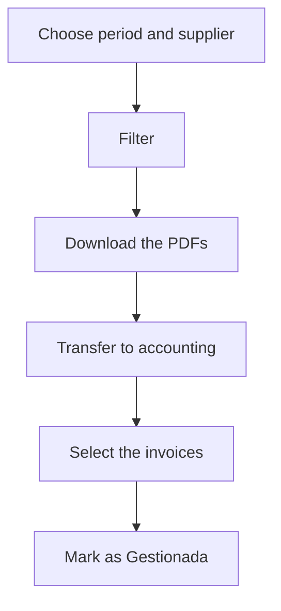

# Purchase invoice accounting

## What this screen is for

Use it to pass a period's purchase invoices to accounting. It lists the invoices that are not processed yet, lets you download their attached documents and mark them as "Gestionada" in one go once they have been transferred. It is the step after registering the invoice in "Purchase invoices".

## Available actions

- Filter by "Period" and "Supplier" and apply the filter with "Filter".
- Include invoices that are already processed by ticking "Processed".
- Clear the filters and empty the list with "Clear filters".
- Select invoices with each row's checkbox, or all of them with the header checkbox.
- Mark the selected invoices as "Gestionada" with the green check button, to the right of the filters.
- Download an invoice's attached documents with the download icon on its row.

## Usual flow

1. Open "Purchase invoice accounting". The list starts empty.
2. Choose the "Period" (for example, the month or quarter you are accounting for) and, if needed, a supplier, and click "Filter".
3. Download each invoice's PDF with the download icon and enter it in the accounting software.
4. Select the invoices you have already transferred.
5. Click the green check button: "Invoices accounted for" appears with the number of invoices, and they disappear from the list.

## Important notes

- The list does not load until you choose a "Period" and filter. The period filters by invoice date.
- With "Processed" unticked, the list hides invoices already in the "Gestionada" status. Ticking or unticking it reloads the list if a period is set.
- The check button sets the "Gestionada" status on every selected invoice, whatever its current status. The "Gestionada" status must exist in the purchase invoice lifecycle.
- This screen does not undo the mark: to change an invoice's status, open it in "Purchase invoices".
- The download icon downloads every file attached in the invoice's "Files" tab. If there are none, nothing is downloaded.
- The "Due date" column shows the last due date, or the invoice date if there is none. The "Base amount" column is the taxable base.
- Rows do not open the invoice record.

## Common errors

- If "Invalid filter" appears with "Select a period", choose a start date and an end date.
- If the check button is disabled, select at least one invoice.
- If an invoice does not appear, check that its invoice date is inside the period and, if it is already processed, tick "Processed".
- If nothing happens when you click the check button, check in "Lifecycles" that purchase invoices have a status called "Gestionada".
- If the download gets no file, attach the PDF in the invoice's "Files" tab.

## Basic process

