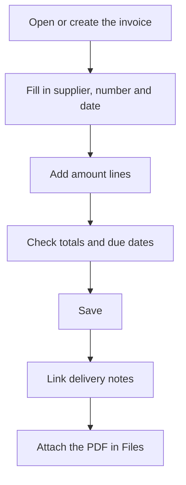

# Purchase invoice

## What this screen is for

This is the record of a supplier invoice: the header, the breakdown of amounts by VAT rate, the payment due dates, the delivery notes it covers and the attached documents. From here you enter an invoice by hand or review and edit an existing one. It is the last step of the cycle `purchase order -> receipt delivery note -> purchase invoice`.

## Available actions

- Fill in the header: "Financial year", "Series", "Status", "Supplier", "Supplier invoice no.", "Invoice date", "Payment method", "Freight", "% withholding tax" and "% discount".
- Save the invoice with "Save" in the screen header.
- Add amount lines in the "Amounts" tab with the "+" button, edit them by clicking the row and delete them with the cross.
- Check the due dates in the "Due dates" tab.
- Split the due date amounts by hand with "Edit due dates", in the arrow menu of the "Save" button.
- Link the supplier's uninvoiced delivery notes in the "Delivery notes" tab with the "+" button, and unlink them with the cross.
- Attach or download documents in the "Files" tab.

## Usual flow

1. From "Purchase invoices", click "+" to create an invoice, or open one from the list.
2. Choose the "Supplier": the "Payment method" is filled with the supplier's.
3. Enter the "Supplier invoice no." and the "Invoice date".
4. In "Amounts", add a line for each VAT rate with the "Base amount" and the "VAT".
5. Fill in "Freight", "% withholding tax" or "% discount" if the invoice has them, and check the "Total".
6. Click "Save".
7. Open the invoice again to link its delivery notes in "Delivery notes" and attach the PDF in "Files".

## Important notes

- A new invoice defaults to the financial year of the invoice date, the "Nacional" series and the "Nova" status. The internal number is assigned on save, from the counter of the financial year that matches the invoice date, and the invoice is filed in that year.
- The "Status" only offers the transitions allowed from the current status, defined in "Lifecycles".
- Totals are calculated automatically: "Base" is the sum of the amount lines' bases; the "Total" is base plus freight, plus taxes, minus the withholding tax (calculated on base and freight), minus the discount.
- Each amount line calculates its tax from the "Base amount" and the tax percentage; with a reverse-charge tax the tax amount is 0.
- Due dates are generated from the payment method, the invoice date and the total. They are recalculated every time you change the date, the payment method, the freight, the withholding tax, the discount or the amount lines, and they replace the previous ones, including those split by hand.
- "Edit due dates" only appears when the invoice has more than one due date. The amounts must add up to the invoice total; the changes are stored when you click "Save" at the foot of the table.
- On an invoice that is already saved, amount lines are stored as soon as you add, edit or delete them. The header totals are stored with "Save".
- There cannot be two invoices from the same supplier with the same "Supplier invoice no.". The check does not apply when the number is "--", the default value of a new invoice.
- "Delivery notes" only offers the supplier's delivery notes that are not invoiced yet. Unlinking one makes it pending to invoice again.
- After "Save", the application goes back to the previous screen.

## Common errors

- If "You must enter the invoice amounts" appears, add at least one line in "Amounts".
- If "Every VAT line must have a tax" appears, open the lines with no tax and choose one.
- If no due dates are generated, check that there is a supplier, a payment method and a tax on every amount line.
- If "The supplier invoice … is already registered as invoice …" appears, check the number: that invoice already exists.
- If "Invalid exercise" appears, check that there is an active financial year covering the invoice date.
- If "The sum (…) does not match the invoice total (…)" appears, adjust the due dates until the "Difference" is 0.
- If you cannot link delivery notes to a new invoice, save it first and open it again.

## Basic process

