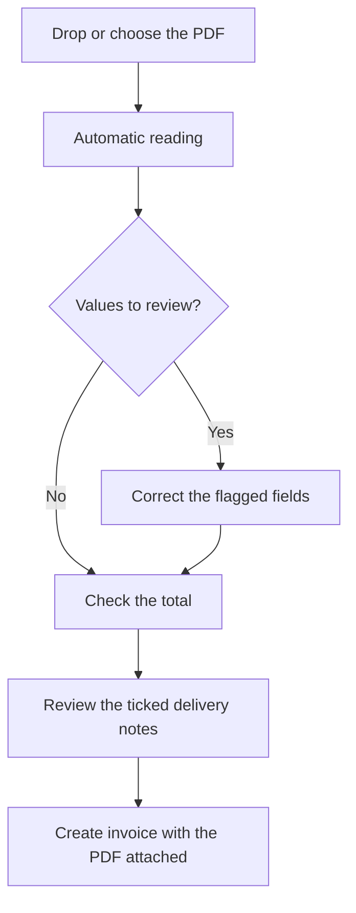

# Import purchase invoice

## What this screen is for

It creates a purchase invoice from the PDF the supplier sent. The system reads the PDF, prepares a draft invoice, flags the values you need to review and suggests the pending delivery notes it covers. Nothing is saved until you click "Create invoice". You reach it from the PDF button in "Purchase invoices".

## Available actions

- Drop the PDF on the screen or pick it with "Choose a PDF".
- View the PDF next to the draft, with zoom and full screen.
- Switch document with "Change PDF", or read it again with "Try again" if reading fails.
- Review and correct the invoice header (the same fields as in the invoice record).
- Add, edit and delete lines of the "VAT breakdown".
- Create the supplier without leaving the screen with "Create supplier", when the invoice's VAT number matches no supplier.
- Open the invoice already registered with "Open invoice", when the PDF is a duplicate.
- Tick or untick the "Delivery notes to invoice" that the invoice covers.
- Create the invoice with "Create invoice", in the screen header.

## Usual flow

1. In "Purchase invoices", click the PDF button ("Import invoice (PDF)").
2. Drop the PDF or click "Choose a PDF", and wait while "Reading the invoice..." is shown. It can take up to a minute.
3. Go through the list of values to review and the flagged fields, comparing them with the PDF.
4. Check that the "Computed total" matches the "PDF total".
5. Review the ticked delivery notes in "Delivery notes to invoice" and check that "Selected delivery notes" matches the "Invoice taxable base".
6. Click "Create invoice". The invoice is created with the ticked delivery notes, the PDF is attached to it and its record opens.

## Important notes

- Digital PDFs up to 20 MB are accepted. The system reads the supplier's VAT number and name, the invoice number and date, the bases and tax amounts per VAT rate, the withholding tax, the total and the delivery note numbers printed on the invoice.
- The supplier is assigned automatically when exactly one active supplier has the invoice's VAT number, and then the "Payment method" is filled with the supplier's. If several match, you must choose. If none matches, "Create supplier" opens the new supplier form with the name and VAT number already filled in and, once saved, it is assigned to the invoice.
- Each VAT rate is matched to the active tax with the same percentage. If there is none or there are several, the line is left without a tax, showing the rate read from the PDF, and you must choose it.
- The withholding goes into the "% withholding tax" field. If the PDF only shows the withheld amount, the percentage is calculated on the base.
- The equivalence surcharge is not imported: it is flagged so you enter it by hand, and the "Computed total" shows the surcharge amount not imported.
- "Freight" and "% discount" are not filled in.
- Values are flagged for review when they could not be read, were read with low confidence, a Spanish VAT number is invalid, a tax amount does not match its base and rate, or the total does not match. A field stops showing its warning once you change it, and a VAT line once you save it.
- Pending delivery notes are listed with their amount before VAT. Delivery notes whose number (the supplier's or the internal one) is printed on the invoice are ticked automatically; if none is, the single combination of delivery notes that adds up to the taxable base is ticked. If you change the supplier, the list reloads.
- The invoice is created in the financial year of the invoice date, with the "Nacional" series and the "Nova" status, and the internal number is assigned on creation.
- "Change PDF" reads the new document and discards the corrections made to the draft.
- If the reading service is not configured, the screen says so and the import button does not appear in "Purchase invoices".

## Common errors

- If "The file must be a PDF" or "The PDF is larger than 20 MB" appears, export the invoice to PDF or reduce its size and try again.
- If "The invoice data could not be read" appears, the PDF may be scanned or protected: enter the invoice by hand from "Purchase invoices".
- If "The invoice reading service is unavailable" appears, wait a while and click "Try again".
- If the computed total does not match, check the bases, the tax amounts, the "% withholding tax" and whether the invoice has a surcharge or freight.
- If "Duplicate invoice" appears, the invoice is already registered: open it with "Open invoice", which opens in a new tab.
- If "Every VAT line must have a tax" appears, choose the tax on the flagged lines.
- If "A selected delivery note does not belong to the supplier or is already invoiced" appears, nothing was created: untick that delivery note and create the invoice again.
- If "The invoice was created but the PDF could not be attached" appears, attach it from the invoice's "Files" tab.

## Basic process

