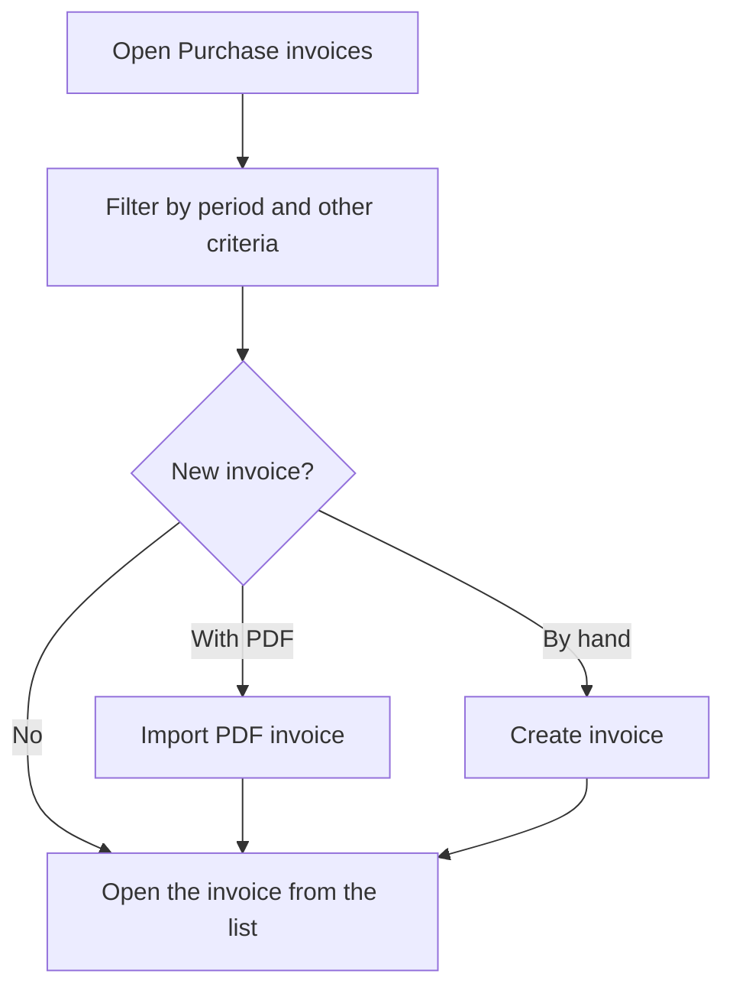

# Purchase invoices

## What this screen is for

It lists the invoices received from suppliers. Use it to find them by date, supplier, payment method, bank account or due date, to create a new one by hand or from the supplier's PDF, and to open an invoice's record. The invoice closes the purchasing cycle: `purchase order -> receipt delivery note -> purchase invoice -> due dates`.

## Available actions

- Filter by "Period", "Supplier", "Payment method", "Account number" and "Due date", and apply the filter with "Filter".
- Clear the filters with "Clear filters": the period goes back to the current year.
- Create an invoice by hand with the "+" button ("Create new").
- Import an invoice from the supplier's PDF with the PDF button ("Import invoice (PDF)").
- Open an invoice by clicking its row.
- Delete an invoice with the cross on its row, only while it is in the initial status.

## Usual flow

1. Open "Purchase invoices". It shows the invoices of the current year, or the last filters you applied.
2. Adjust the "Period" and, if needed, the supplier or the due date, and click "Filter".
3. Check the total of the "Amount" column at the foot of the table.
4. To register a PDF invoice, click the PDF button; to enter one by hand, click "+".
5. Click a row to review or edit the invoice.

## Important notes

- The "Period" filters by invoice date and is required.
- The "Due date" column shows the invoice's last due date, or the invoice date if it has none. The "Due date" filter uses that same date.
- The "Account number" filter searches by the supplier's bank account number.
- The "Amount" column is the invoice total, and the foot of the table shows its sum.
- The screen remembers the last filters you applied.
- The PDF import button only appears when the invoice reading service is configured.
- The delete cross only appears on invoices in the initial status of the purchase invoice lifecycle. Deletion is permanent.

## Common errors

- If "Invalid filter" appears with "Select a period", choose a start date and an end date in the "Period".
- If you cannot find an invoice you know exists, check that its invoice date is inside the period and that you do not have saved supplier, payment method or due date filters.
- If you do not see the PDF import button, the reading service is not configured; ask an administrator to check it.
- If you cannot delete an invoice, check that it is still in the initial status.

## Basic process

