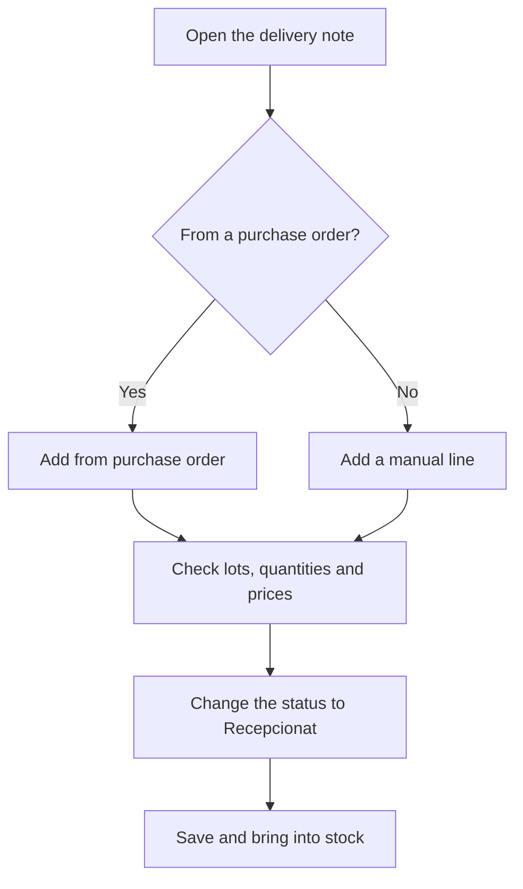

# Receipt delivery note

## What this screen is for

This is the record of a purchase delivery note: it registers what arrived from a supplier, in what quantity, with which dimensions and at what price. When the delivery note moves to the "Recepcionat" status, the material enters stock. Lines can come from the supplier's pending purchase orders, and later the delivery note is linked to the purchase invoice.

## Available actions

- Edit the header ("Financial year", "Delivery note date", "Status", "Supplier", "Delivery note number") and save it with "Save".
- Add lines from the supplier's pending purchase orders with "Add from purchase order".
- Add a manual line with "Add line".
- Edit a line by clicking its row.
- Delete a line with the cross on its row.
- Create a new reference from the "Reference" tab of the line dialog.
- Open the lot traceability of a line with the tree icon on its row.
- Attach or view documents in the "Files" tab.

## Usual flow

1. Open the delivery note from the list and enter the "Delivery note number" printed on the supplier's paper.
2. If the material comes from a purchase order, click "Add from purchase order", tick the received order lines, adjust the "Pending quantity" and the "Amount", and click "Add".
3. If there is no purchase order, click "Add line", choose the "Purchase reference", fill in the dimensions and the "Quantity", and click "Create".
4. If the reference is lot-tracked, choose or create the lot on each line.
5. Change the "Status" to "Recepcionat" and click "Save" to bring the material into stock.
6. Attach the scanned delivery note in the "Files" tab if needed.

## Important notes

- The "Number" is internal and cannot be changed. The "Status" only offers the transitions allowed from the current status, defined in "Lifecycles".
- Moving to "Recepcionat" creates a stock entry in the warehouse's default location for every line that did not have one yet. Lines for service references do not create stock.
- Moving the delivery note out of "Recepcionat" to another status removes the stock entries of its lines.
- While the delivery note is "Recepcionat", "Add from purchase order" and "Add line" are disabled. Lines already in stock do not show the delete cross.
- On moving to "Recepcionat", if a line comes from a purchase order linked to an external phase of a work order and that order line has been fully received, the phase is closed.
- When lines are added from a purchase order, the received quantity is added to the order line, which moves to "Rebuda parcialment" or "Rebuda"; when every line is received, the purchase order moves to "Rebuda". Deleting the delivery note line subtracts that quantity and recalculates the statuses.
- In the "Purchase order selection" dialog, the "Amount" is the total price of the group and is split among the ticked lines by quantity. If you leave it empty, the lines are added with a zero amount.
- On a manual line, the "Format" comes from the reference and decides which dimensions can be filled in. For "RODO", "TUB" and "PLACA" the weight and the price are calculated from the dimensions and the "Price / kilo"; for "UNITATS", the "Price" is "Unit price" × "Quantity".
- When you choose the reference, the price defaults to this supplier's price for the reference or, if there is none, to the reference price. The description is filled with the reference name if it was empty.
- If the reference is lot-tracked and you do not give a lot, the line is assigned to a lot with no code.
- Every time you save the delivery note, the line prices are stored as the reference's last cost and as the supplier's price for that reference; if the supplier did not have the reference, it is added.
- After "Save", the application goes back to the previous screen.

## Common errors

- If the buttons to add lines are disabled, the delivery note is already "Recepcionat". If the lifecycle allows it, move it back to the previous status, make the change and set it to "Recepcionat" again.
- If "Add from purchase order" shows nothing, check that the delivery note's supplier has purchase orders with lines still to receive (neither received nor cancelled).
- If "Select at least one line to add to the delivery note" or "Lines with quantity 0 cannot be added" appears, tick at least one order line and check that the "Pending quantity" is not 0.
- If the "Weight/price calculator" warns "Reference without format" or "Reference without type", complete the reference's format and type in "Purchase references".
- If "The selected lot does not belong to this reference" appears, choose a lot of the same reference.
- If "The entered reference and version already exist" appears when creating a reference, look for it in the line's dropdown.
- If the "Quantity" shows an error, it must be at least 1.

## Basic process

