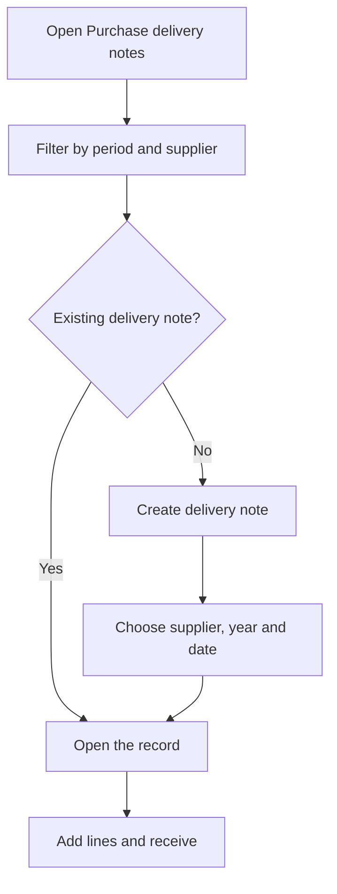

# Purchase delivery notes

## What this screen is for

It lists the receipt delivery notes for the materials and services that arrive from suppliers. From here you search them by period and supplier, create a new delivery note and open its record to register its lines. The delivery note sits between the purchase order and the invoice: `purchase order -> receipt delivery note -> stock -> purchase invoice`.

## Available actions

- Filter by "Period" and "Supplier" and apply the filter with the "Filter" button; "Clear filters" goes back to the current year with no supplier.
- Create a delivery note with the "+" button ("Create new"): the "Create delivery note" dialog opens.
- Open a delivery note by clicking its row.
- Delete a delivery note with the cross on its row, only while it is in the initial status.

## Usual flow

1. Open "Purchase delivery notes". By default it shows the delivery notes of the current year.
2. If needed, pick a supplier in the filter and click "Filter".
3. To register a delivery, click "+", choose the "Supplier", check the "Financial year" and the "Date", and click "Create".
4. The new delivery note's record opens: add its lines (see the record's help).
5. To look at an existing one, click its row.

## Important notes

- The "Period" is required: without a complete period the search does not run.
- The "Number" column is the internal number, assigned automatically from the counter of the chosen financial year. The "Delivery note number" column is the number printed on the supplier's delivery note.
- A new delivery note is created with the initial status of the delivery note lifecycle, set up in "Lifecycles".
- When creating the delivery note, the "Financial year" defaults to the one named after the current year.
- The delete cross only appears on delivery notes in the initial status. Deletion is permanent and also removes the lines.
- Deleting a whole delivery note does not subtract the received quantities from the purchase orders. If the delivery note has lines that come from a purchase order, delete those lines first from the record: deleting a line subtracts its quantity from the purchase order.
- The color of the "Status" tag is the color of the status in the lifecycle.

## Common errors

- If "Invalid filter" appears with "Select a period", choose a start date and an end date in the "Period" filter.
- If the delivery note cannot be created because the financial year does not exist or its counter fails, check that the chosen financial year is set up correctly.
- If creating reports that the lifecycle has no initial status, define one in "Lifecycles".
- If you do not see the cross to delete a delivery note, it is no longer in the initial status.

## Basic process

