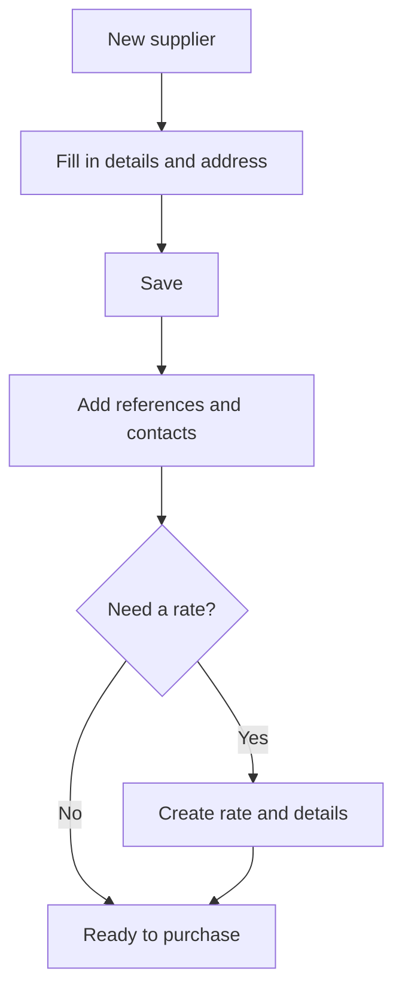

# Supplier

## What this screen is for

This is a supplier's record: tax and contact details, address, payment method and purchasing terms. The references and rates you define here are reused later when you create purchase orders (price, description and expected date of each line) and when external services and transport are calculated in quotations and sales orders. The supplier list and the supplier types are managed on the "Suppliers" screen.

## Available actions

- Fill in or change the details on the "Supplier" tab and save them with "Save", in the screen header.
- Look up the address with "Search location" to fill in the address fields and the coordinates automatically.
- Check the coordinates and the distance in the collapsible "Coordinates and distance" section, and open them with "View on map".
- Add, edit or delete, on the "References" tab, the purchase references this supplier sells, with their code, description, price and supply days.
- Add, edit or delete contact people on the "Contacts" tab.
- Create, edit, duplicate or delete rates on the "Purchase rates" tab, and define their details per reference.
- Create and maintain transport rates on the "Transport rates" tab (only for suppliers of type "Logistica").

## Usual flow

1. From "Suppliers", press "+" to open the "New supplier" screen.
2. Fill in "Trading name", "Legal name", "VAT number" and "Supplier type".
3. Choose the "Country" and use "Search location" to fill in the address; check "Address", "City", "Region" and "Postal code".
4. Fill in "Phone", "Payment method" and "Account number", and press "Save".
5. Once the supplier is created, the other tabs appear: add under "References" what you buy from this supplier and under "Contacts" the people to deal with.
6. If needed, create a rate with its dates under "Purchase rates" and add its details.

## Important notes

- The "References", "Contacts" and "Purchase rates" tabs only appear after the supplier has been saved for the first time.
- Required fields: "Trading name", "Legal name", "VAT number" (up to 15 characters), "Supplier type", "Address", "City", "Region", "Postal code", "Phone", "Payment method" and "Account number" (up to 35 characters).
- Two suppliers cannot share the same trading name.
- "Search location" is only enabled after you choose the "Country".
- On save, if there are no coordinates, the app tries to get them from the address, and it calculates the "Distance from site (km)". That field cannot be edited.
- Under "References", "Supplier price" and "Supply days" are the values proposed when you add that reference to a purchase order for this supplier: the price, the description and the expected date (today plus the supply days). The same reference can only be added once per supplier.
- When a receipt delivery note from this supplier is saved, the "Supplier price" of each reference is updated with the price on the delivery note; if the reference was not there yet, it is added automatically.
- Under "Purchase rates", click a rate to see its "Details" in the lower table. The "+" button for details is only enabled when a rate is selected. Each detail sets the "Reference", the "Calculation type" ("Units", "Volume" or "Weight"), the "From" and "To" range and the "Price (€)".
- The purchase rate valid on a given date decides whether this supplier's external services are calculated by units, volume or weight in quotations and sales orders.
- A supplier's purchase rates cannot overlap in dates. "Duplicate" creates a new rate with the name and dates you enter and copies all its details.
- The "Transport rates" tab only appears if the supplier's type is named exactly "Logistica". Each rate has validity dates and details by weight, volume and distance ranges, each with its price.
- "Purchase order notes" is a text field separate from the general "Notes".

## Common errors

- If "Supplier ... already exists" appears when creating the supplier, there is already a supplier with that trading name: look for it in the list.
- If the form does not save, check the messages under the required fields, especially the address, the payment method and the account number.
- If you cannot type in "Search location", choose the "Country" first.
- If "The reference already exists" appears when adding a reference, that reference is already linked to the supplier: edit the existing row.
- If you cannot save or duplicate a purchase rate, check that its dates do not overlap another rate of the same supplier and that the end date is not before the start date.
- If you do not see the "Transport rates" tab, check that the supplier's type is "Logistica".

## Basic process

