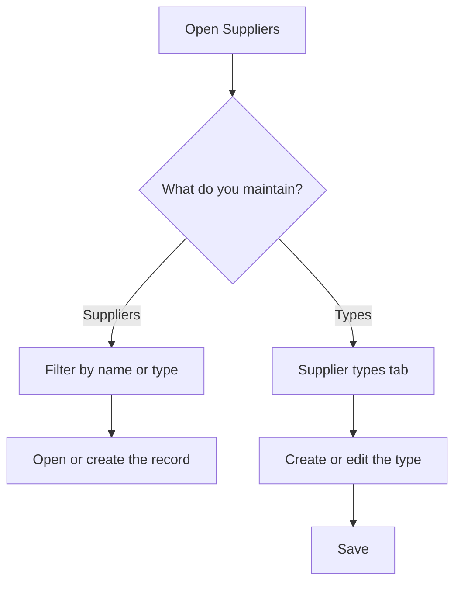

# Suppliers

## What this screen is for

This is the company's supplier directory and, on the same screen, the catalog of supplier types. From here you find a supplier to open their record, add a new one, or maintain the classification by type. The supplier is the starting point of the whole purchasing flow: purchase order -> receipt delivery note -> purchase invoice.

## Available actions

- Search suppliers with the "Name" filter (it searches the trading name) and the "Type" filter. The list filters as you type or select.
- Open a supplier's record by clicking the row.
- Create a supplier with the "+" button ("Create new") on the "Suppliers" tab.
- Delete a supplier with the "X" on the row, after confirming.
- Switch to the "Supplier types" tab to see the catalog of types.
- Create a type with the "+" button on that tab, or edit one by clicking the row: a dialog opens with "Name", "Description" and the "Save" button.
- Delete a supplier type with the "X" on the row, after confirming.

## Usual flow

1. Open the "Suppliers" screen.
2. Type part of the trading name in "Name" or pick a "Type" to narrow the list.
3. Click the row to open the supplier's record.
4. If the supplier does not exist, press "+" and fill in the new supplier's record.
5. If a classification is missing, go to "Supplier types", press "+", fill in "Name" and "Description" and press "Save".

## Important notes

- The "+" button creates a supplier or a supplier type depending on the active tab.
- The list shows "Trading name", "Legal name", the tax ID (column "CIF"), "Phone" and "Type".
- Every supplier needs a type: the "Supplier type" field on the record is required. Create the types before adding suppliers.
- The type named exactly "Logistica" has a special use: suppliers of that type show the "Transport rates" tab on their record, and they are the ones you can choose as carriers in quotations and sales orders. Do not rename that type.
- In the type dialog, "Name" and "Description" are required and accept up to 250 characters.
- Deleting a supplier or a type is permanent, and the app does not allow it once they have been used: a supplier with purchase orders, delivery notes, invoices, rates or external services, or a type with suppliers assigned, is not deleted and a warning appears. If a type has suppliers, change their type first.

## Common errors

- If "The supplier ... could not be deleted" or "The supplier type ... could not be deleted" appears, the supplier has already been used and must be kept, or the type has suppliers whose type you must change first.
- If you cannot find a supplier, check that the "Type" filter is empty and that you are searching by trading name, not legal name.
- If "Entity already exists" appears when creating a type, a type with that name already exists.
- If the type dialog does not save, check that "Name" and "Description" are filled in.
- If a carrier does not appear in quotations or sales orders, check that its type is "Logistica".
- If the "+" button opens a screen you did not expect, check which tab is active.

## Basic process

