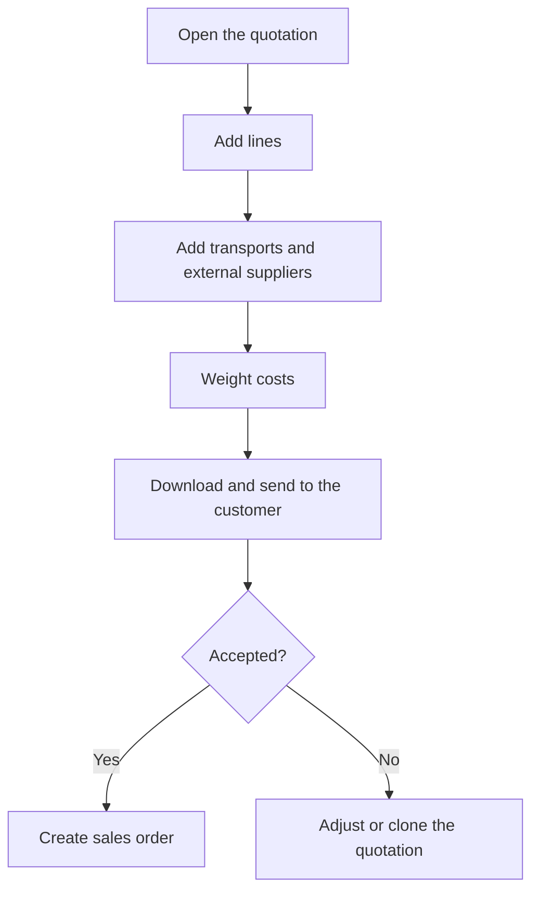

# Quotation

## What this screen is for

This is a sales quotation record. Here you prepare the offer for the customer: the lines with reference, costs, margins and price, the transports and the external services. When the customer accepts it, you generate the sales order from here (quotation -> sales order -> delivery note -> invoice) and download the document to send it.

## Available actions

- Change the header ("Registration date", "Acceptance date", "Status", "Customer", "Calendar days for delivery", "Internal notes") and save it with "Save".
- Open the arrow menu of "Save" to:
  - "Download": generate the quotation as a Word document.
  - "Print PDF": generate the quotation as a PDF.
  - "Create sales order": generate the sales order from the quotation.
  - "Clone quotation": create a new quotation with the same lines.
- Open the customer record with the magnifier next to the "Customer" field.
- "Details" tab: add lines with "Add line", edit them by clicking the row, delete them with the "X" and distribute costs with "Weight costs".
- "Transport" tab: add transports with "Add transport", edit them and delete them.
- "External services" tab: choose the "Supplier" of each external service.

## Usual flow

1. Check the "Customer" and the "Calendar days for delivery".
2. In "Details", press "Add line", choose the "Reference" and, if it has one, the "Manufacturing route"; adjust "Quantity", margins and "Discount", and press "Save".
3. If there are external services, choose their "Supplier" in "External services".
4. If shipping is charged, add it in "Transport" with the carrier and the rate.
5. Press "Weight costs" so transport and external services are distributed across the lines.
6. Download the document with "Download" or "Print PDF" and send it to the customer.
7. When the customer accepts, choose "Create sales order": the new sales order opens.

## Important notes

- "Quotation" (the number) and "Sales order" are read-only. "Sales order" shows the number of the sales order created from this quotation.
- The "Status" dropdown only offers the status changes allowed from the current status, as defined in "Lifecycles".
- When the status changes from "Pendent d'acceptar" (pending acceptance) to "Acceptat" (accepted), the "Acceptance date" is filled in with the current date. Status names are shown as they are configured in the lifecycle.
- "Save" saves the header and returns to the previous screen. Lines, transports and external services are saved immediately, each from its own dialog.
- "Create sales order" creates a sales order dated today, in the fiscal year of the current date, with an expected date of today plus the "Calendar days for delivery". It copies the lines, transports and external services, and sets the quotation to "Acceptat" with today as the acceptance date. It uses the customer and delivery days shown on screen, even if you have not saved them.
- A quotation can only have one sales order. Once it exists, "Add line", "Weight costs", "Add transport" and the icons to delete lines and transports disappear.
- In a line, "Reference" lists the references of the quotation's customer and those without a customer. If the reference has exactly one active manufacturing route, it is selected automatically and its production, material, service and transport costs are calculated for the given quantity.
- "Profit" and "Total" are calculated from the costs, the profit percentages and the "Discount". The "Unit price" can be adjusted by hand.
- The line's "Margins" tab shows the profit per phase of the route. "Apply" copies the "Weighted profit" to "% Production profit".
- When a line with a route is saved, the system adds its weight to the quotation and adds the services of the route's external phases to "External services".
- In "External services", choosing a supplier calculates the price with its rate (by volume, weight or units) and saves it automatically.
- In a transport, "Ship to end customer" takes the distance of the customer's main address. "Transport rate" only offers the carrier's current rates that fit the weight, volume and distance, sorted from cheapest to most expensive, with the cheapest marked "Best price".
- "Weight costs" distributes the transport cost across the lines by each line's weight, distributes external services using the supplier's rate valid on the quotation date, and recalculates each line's cost, unit price and total. If you had adjusted prices by hand, check them afterwards.
- "Clone quotation" creates a quotation with a new number, today's date and the initial status, with the same customer, lines, transports and external services, and opens it.
- "Automatic notes" is read-only; it shows, for example, the automatic rejection notice of a pending quotation that got too old.
- "Download" and "Print PDF" generate the document in the language set in the customer record.

## Common errors

- If "Create sales order" warns "This document already has an associated document", the quotation already has a sales order: you will find it in the "Sales order" field.
- If "Create sales order" fails with "Customer is not valid for creating an invoice..." or "Customer has no addresses registered...", complete "Legal name", "VAT number", "Account number" and the address in the customer record.
- If it fails with "No exercise found for the current date", create the current year's fiscal year in "Fiscal years".
- If it fails because the site is not valid for creating an invoice, check the billing data of the company's site (address, city, postal code, region, country and VAT number).
- If "Weight costs" returns "Costs could not be weighted.", check that the quotation has lines.
- If a line gets no transport cost when weighting, it probably has no weight: weight is only calculated for lines with a manufacturing route and a reference with a material type.
- If you cannot choose a "Transport rate", choose the carrier first and check that it has current rates for the weight, volume and distance.
- If a line is not saved, check that "Quantity" is 1 or more.

## Basic process

