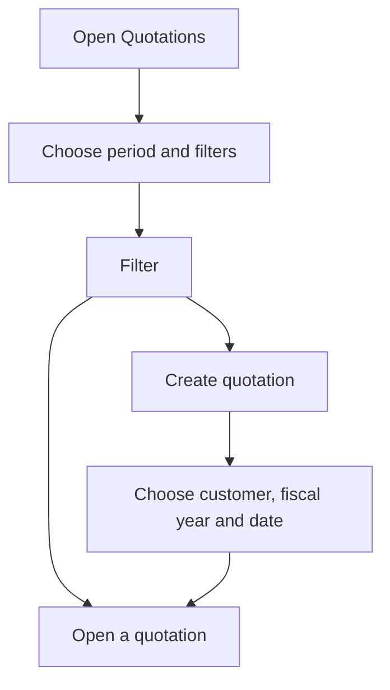

# Quotations

## What this screen is for

It lists the sales quotations for a period and is where new ones are created. The quotation is the first step of the sales flow (quotation -> sales order -> delivery note -> invoice): once the customer accepts it, the sales order is generated from the quotation record.

## Available actions

- Choose the "Period" by quotation date; by default it is the current year.
- Filter by "Customer" and by one or more "Status" values.
- Apply the filters with "Filter".
- Go back to the initial filters with "Clear": it removes the customer and statuses and resets the period to the current year.
- Create a quotation with the "+" button ("Create new"), which opens the "Create quotation" dialog.
- Open a quotation by clicking its row.
- Delete a quotation with the trash icon ("Delete"), only shown on quotations in the initial status.
- Adjust the columns and save views with the gear icon ("View configuration").

## Usual flow

1. Open "Quotations": the current year's quotations are loaded.
2. If needed, change the "Period", choose a "Customer" or some statuses and press "Filter".
3. Review "Number", "Date", "Customer", "Status", "Acceptance date" and "Delivery days".
4. To create one, press "+", choose "Customer", "Fiscal year" and "Date", and press "Save".
5. The system creates the quotation and opens its record so you can add the lines.

## Important notes

- The "Period" is required: without a start date and an end date, the list is not loaded.
- The system assigns the quotation number from the quotation counter of the chosen fiscal year. Fiscal years are managed in "Fiscal years".
- In the create dialog, the suggested "Fiscal year" is the one named after the current year.
- Every new quotation starts in the initial status of the quotation lifecycle, configured in "Lifecycles".
- Quotations still in the "Pendent d'acceptar" (pending acceptance) status 30 days after their date move automatically to "Rebutjat" (rejected), with an automatic note saying so. Status names are shown as they are configured in the lifecycle.
- A quotation can only be deleted while it is in the initial status and has no sales order. Deletion is permanent.
- Filters and columns are kept in your table view, so when you come back to the screen you get the same working context.

## Common errors

- If "Invalid filter" or "Select a period" appears, choose a start date and an end date in "Period".
- If a quotation has no trash icon, it is no longer in the initial status.
- If deleting shows "Cannot delete" with "The quotation has associated sales order ...", the quotation has already become a sales order and must be kept.
- If creation fails with "Error creating counter" or "Lifecycle 'Budget' has no initial status", check the fiscal year in "Fiscal years" or the initial status in "Lifecycles".
- If "Save" does nothing in the dialog, check that "Customer", "Fiscal year" and "Date" are filled in.

## Basic process

