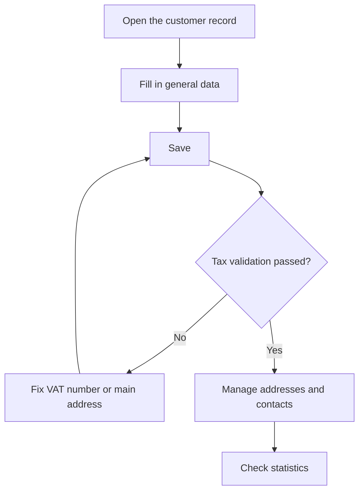

# Customer

## What this screen is for

This is a customer record: here you maintain the commercial and tax data, the contacts, the addresses and a summary of the year's activity. This data is copied to quotations, sales orders, delivery notes and invoices, and the tax data is validated before the customer can be invoiced.

When you arrive from the "+" button in "Customers", the screen shows the title "Create customer" and only the general data tab.

## Available actions

- Fill in or change the general data in the "Customers" tab and save it with "Save" in the header.
- Manage contact people in the "Contacts" tab: add them with "+", edit them by clicking the row and delete them with the trash icon.
- Manage addresses in the "Addresses" tab: add, edit, mark one as "Main" or "Disabled", and delete them.
- Check the year's activity in the "Statistics" tab.

## Usual flow

1. Fill in "Commercial name", "Legal name", "Customer type", "VAT number" and "Account number".
2. Choose the "Language" of the customer's documents and, if needed, the "Payment method".
3. Press "Save".
4. In "Addresses", press "+", enter "Name", "Country", "Address", "City", "Region" and "Postal code", and press "Save".
5. In "Contacts", add the contact people with "Name", "Last name", "Email" and "Phone".
6. Check "Statistics" to see the year's quotations and invoicing.

## Important notes

- Required form fields: "Commercial name", "Legal name", "Customer type", "VAT number" and "Account number".
- On save, the system validates the tax data: the "VAT number" must be a valid Spanish NIF or CIF, and the tax name and account number must be filled in. A new customer has no addresses yet; from then on, every save requires a main address with country, postal code, city and address filled in. If any check fails, nothing is saved.
- A customer without a main address cannot be used on delivery notes or invoices: add it in "Addresses" right after creating the customer.
- Two customers cannot share the same commercial name.
- The "Contacts", "Addresses" and "Statistics" tabs only appear once the customer exists.
- The customer's "Language" is the language its documents are generated in: quotation, sales order, delivery note and invoice.
- The first active address you add is marked as the main address automatically. If no address is marked as main, the first active address is used.
- When an address is saved, the system calculates its coordinates and its distance from the company's site. This distance is used to suggest transport rates in quotations.
- In "Contacts", the "Default" checkbox marks the customer's main contact.
- "Statistics" shows data for the current calendar year: number of quotations, accepted and rejected, number of invoices, total invoiced excluding taxes and a monthly invoicing chart. "Rejected" counts every quotation without an acceptance date, including those still pending.
- Deleting a contact or an address is permanent; to stop using an address without losing it, mark it as "Disabled".

## Common errors

- If "Invalid CIF/NIF" appears, check the format of the "VAT number".
- If "Customer has no addresses registered. Please create an address." appears, the customer has no active address. Add one in "Addresses" and save again.
- If "The main fiscal address of the customer is incomplete..." appears, fill in the country, postal code, city and address of the main address.
- If "Customer is not valid for creating an invoice..." appears, check "Legal name", "Account number" and "VAT number".
- If creation fails because the customer already exists, there is already a customer with that commercial name: look it up in "Customers".
- If an address is not saved, check the required fields: name, country, address, city, region and postal code.

## Basic process

