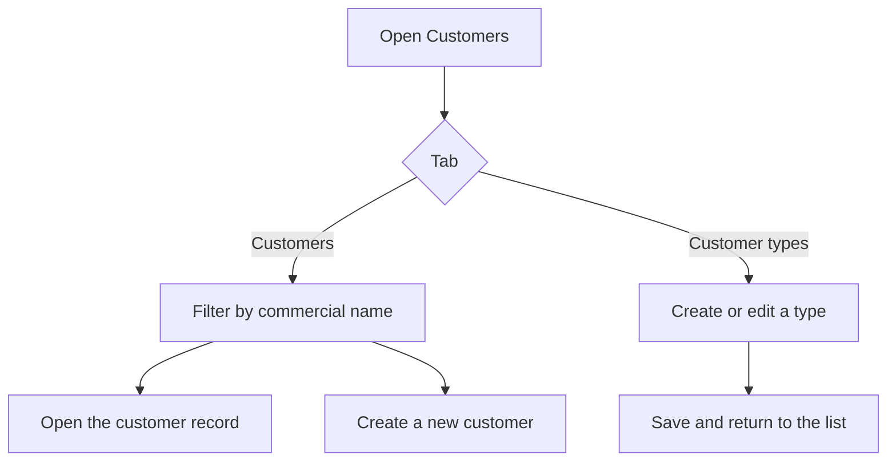

# Customers

## What this screen is for

This is the sales customer list and the starting point to open or create a customer record. The customer is the basis of the whole sales flow (quotation -> sales order -> delivery note -> invoice): every sales document is created for a specific customer.

The screen has two tabs: "Customers", with the customer list, and "Customer types", where you maintain the catalogue of types used to classify customers.

## Available actions

- Search for a customer by "Commercial name" with the filter in the header; the list filters as you type.
- Clear the filter with "Clear".
- Create a new customer with the "+" button ("Create new"): an empty customer record opens.
- Open a customer record by clicking its row.
- Delete a customer with the trash icon ("Delete") on its row, after confirming.
- Switch to the "Customer types" tab to view, create, edit or delete types.
- Adjust the columns and save views with the gear icon ("View configuration").

## Usual flow

1. Open "Customers" and type part of the commercial name in the filter.
2. Check the customer's "Legal name", "CIF" and "Type" in the table.
3. Click the row to open the record and review its data, contacts and addresses.
4. If the customer does not exist, press "+" and fill in the record (see the customer record help).
5. If a customer type is missing, go to "Customer types", press "+", enter "Name" and "Description" and press "Save".

## Important notes

- The filter only searches the commercial name, not the legal name or the CIF.
- The "+" button creates a customer or a customer type depending on the active tab.
- Customer types: each type has a "Name" and a "Description", both required (up to 250 characters). You cannot create a type with a name that already exists. After saving, the screen returns to the list.
- Every customer must have a type: in the customer record, the "Customer type" field is required and its options come from this tab.
- Deleting a customer is permanent, not a deactivation: its contacts and addresses are deleted too. Only delete customers created by mistake that have no sales documents.
- Deleting a customer type is also permanent and can take the customers assigned to it along with it. Before deleting a type, change the type of its customers.
- The "Disabled" column is shown in the table, but the customer record does not let you change it.

## Common errors

- If you cannot find a customer, check the filter: it only searches the commercial name. Press "Clear" and try again.
- If saving a new type shows "Entity already exists", there is already a type with that name.
- If "+" opens a different screen than expected, check which tab is active.
- If you cannot delete a customer or a type, it probably has related documents or customers; review them before trying again.

## Basic process

