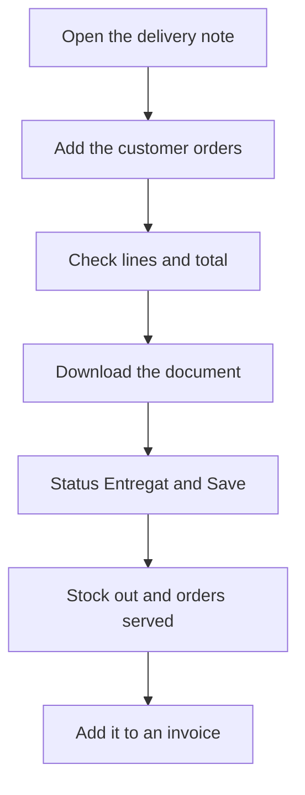

# Delivery note

## What this screen is for

This is the record of a delivery note. Here you add the customer's sales orders being delivered, mark the delivery note as delivered (which takes the stock out of the warehouse) and download its document. The delivered note is then added to an invoice: `quotation -> sales order -> delivery note -> invoice`.

## Available actions

- Save the header with "Save". After saving, you return to the previous screen.
- Open the arrow menu of the "Save" button to:
  - "Download": the delivery note in Word, with prices.
  - "Print PDF": the delivery note in PDF, with prices.
  - "Download without price": the delivery note in Word, without prices.
- Add sales orders with the "Create sales order" button in the lines header. The "Sales order selector" opens: tick the orders and confirm with the check-mark button. Use "Search" to filter by order number or by customer order number.
- Remove a sales order from the delivery note with the cross on its line group header.
- Deliver the delivery note: change the "Status" to "Entregat" and click "Save".
- Undo the delivery: change the "Status" from "Entregat" to another status and click "Save".
- Open the customer record with the magnifying glass next to the "Customer" field.

## Usual flow

1. Open the delivery note, usually created from the sales order with "Create delivery note".
2. If more orders of the same customer are being delivered, click "Create sales order", tick them in the selector and confirm.
3. Check the lines grouped by order and the total.
4. Download the delivery note without price to go with the goods, if needed.
5. When the goods leave, change the "Status" to "Entregat" and click "Save".
6. Then add the delivery note to an invoice from "Sales invoices".

## Important notes

- "Delivery note number", "Creation date" and "Invoice number" are read-only. "Invoice number" shows the invoice that contains the delivery note.
- Lines are not edited here: they are copied from the sales order lines when the order is added. If a line is wrong, remove the order, correct it and add it again.
- The selector only lists this customer's orders that are not on any delivery note yet. An order can only be on one delivery note.
- Removing an order deletes its lines from the delivery note and returns the order to the "Comanda" status, free for another delivery note.
- The status can only change to "Entregat" or from "Entregat". Any other change is rejected. Status names are shown exactly as they are defined in the lifecycle.
- When the delivery note is delivered:
  - The quantity of each line leaves stock, at the default location, with a "Delivery note" movement and the number. Service references do not move stock.
  - If the reference is lot-tracked, the lot of the manufacturing order that produced the line is used, or one is resolved.
  - The delivery note's sales orders move to "Comanda Servida".
  - If the "Delivery date" is empty, it is set to today.
- When the delivery is undone, the stock comes back in with a "Return delivery note" movement, the orders go back to "Comanda" and the "Delivery date" is cleared.
- A delivered delivery note has its customer and delivery date locked, does not allow adding or removing orders, and "Save" is only enabled if you change the status.
- An invoiced delivery note is closed: the status is locked and "Save" is disabled, but the downloads remain available. To change it, remove it from the invoice first.
- Stock movements can be checked in "Warehouse movements".

## Common errors

- If "Cannot edit a delivered delivery note" appears, undo the delivery first by changing the status and saving.
- If "The delivery note status can only be changed through the delivery action" appears, choose "Entregat" or, if it is already delivered, another status to undo the delivery.
- If "Cannot undo delivery of an invoiced delivery note" appears, first remove the delivery note from its invoice, in "Sales invoices".
- If the sales order selector is empty, the customer has no orders waiting for a delivery note: check in "Sales orders" that they exist and are not already on another delivery note.
- If "The order is already assigned to another delivery note" appears, remove it from the other delivery note first.
- If "No default location defined in the project" appears when delivering, tell your administrator: the warehouse default location must be configured.
- If "The lot is already closed and cannot be reopened" appears when undoing the delivery, the line's lot has been closed and the stock cannot return to it.

## Basic process

