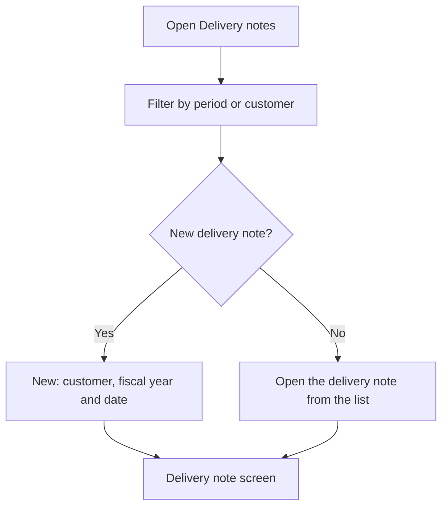

# Delivery notes

## What this screen is for

This is the list of customer delivery notes. Here you look up the delivery notes of a period, filter them by customer, open one or create a new one. The delivery note records the delivery of sales orders and is what gets invoiced afterwards: `quotation -> sales order -> delivery note -> invoice`.

## Available actions

- Filter by "Period" and "Customer", and apply the filter with "Filter".
- Reset the filters with "Clear": it removes the customer and sets the period back to the current year. Then click "Filter" to reload the list.
- Create an empty delivery note with "New": the "Create delivery note" dialog opens, where you choose the "Customer", the "Fiscal year" and the "Date".
- Open a delivery note by clicking its row.
- Delete a delivery note with the trash icon ("Delete"), after confirming.

The table shows the "Number", "Creation date", "Delivery date", "Customer" and "Status".

## Usual flow

1. Open "Delivery notes". The delivery notes created during the current year load.
2. Adjust the period or customer and click "Filter".
3. Open the delivery note you want to review, deliver or download.
4. If you need to create a delivery note by hand, click "New", choose the customer, check the fiscal year and date, and confirm.
5. On the screen that opens, add the customer's sales orders being delivered.

## Important notes

- The period filters by the delivery note's creation date, not its delivery date. Without a complete period the list does not load and the "Select a period" notice appears.
- This list does not remember its filters: every time you open it, it goes back to the current year with no customer.
- The usual way to create a delivery note is from the sales order, with "Create delivery note". Here it is created empty and the orders are added afterwards.
- The delivery note number is assigned by the system from the chosen fiscal year's counter, and the delivery note starts in the initial status of its lifecycle ("Lifecycles").
- The customer must have a tax name, VAT number, account number and at least one active address, and the company's default site must have complete billing data.
- The trash icon only appears on delivery notes that are in the initial status and not invoiced. In addition, a delivered delivery note, or one that still has sales orders, cannot be deleted: remove the orders from its screen first.
- Deleting a delivery note removes it permanently.

## Common errors

- If "Select a period" appears, enter a start and an end date and click "Filter" again.
- If "Cannot delete a delivery note with associated orders" appears when deleting, open the delivery note, remove the orders with the cross on each group and try again.
- If "Cannot delete a delivered delivery note" or "Cannot delete an invoiced delivery note" appears, the delivery note is already part of the delivery or invoicing flow and must not be deleted.
- If "Customer is not valid for creating an invoice" appears when creating the delivery note, complete the customer's tax name, VAT number and account number in "Customers".
- If "Customer has no addresses registered" appears, add an address to the customer.
- If you cannot find a delivery note, remember that the period is compared with the creation date.

## Basic process

