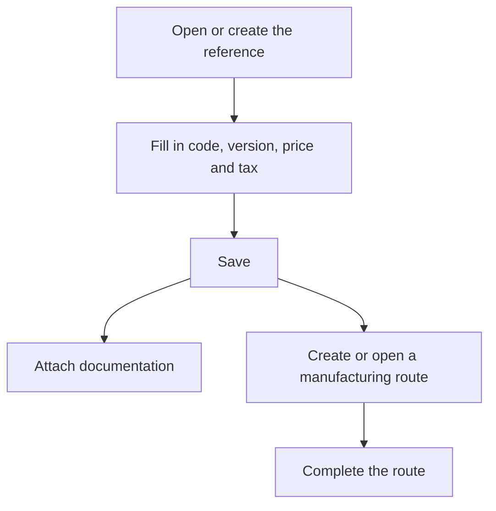

# Reference

## What this screen is for

This is a sales reference record. Here you define the code, version, price, tax and, if the part is exclusive to one customer, the customer. You also attach the technical documentation and create the manufacturing routes that calculate its cost and that quotations and work orders use later on.

When you arrive from the "+" button in "Sales references", the screen shows the title "Create reference".

## Available actions

- Fill in the reference data and save it with "Save" in the header.
- Upload, view and download documents in the "Documentation" tab.
- In the "Manufacturing routes" tab:
  - Create a new route with the "+" button: the route is created and opens so you can complete it.
  - Open an existing route by clicking its row.
  - Delete a route with the "X", after confirming.

## Usual flow

1. Enter "Code", "Description" and "Version".
2. Choose the "Material type" and, if the part is exclusive to one customer, the "Customer".
3. Enter the "Unit price" and the "Tax"; tick "Service" if it is not a physical part.
4. Press "Save": the reference is created and the "Manufacturing routes" tab appears.
5. Attach drawings or specifications in "Documentation".
6. In "Manufacturing routes", press "+" and complete the route on the screen that opens.

## Important notes

- Required fields: "Code" (up to 50 characters), "Description" (up to 250), "Version" (up to 20), "Unit price" and "Tax".
- A new reference starts at "Version" 1.
- "Theoretical manufacturing cost" and "Last manufacturing cost" are read-only. The first is updated when the reference's manufacturing route is saved; the second, from the costs of the work orders.
- The "Unit price" is the price suggested when the reference is added to a quotation line and no costs have been calculated.
- If you set the "Customer", the reference is only offered on that customer's quotation lines; without a customer, it is offered to everyone.
- The "Manufacturing routes" tab only appears once the reference is saved. For each route, the table shows "Base quantity", "Machine cost", "Operator cost", "Material cost", "External cost" and "Total cost".
- After saving a new reference, you stay on the record to continue with documentation and routes. After saving an existing reference, the screen returns to the previous screen.
- A reference with a manufacturing route cannot be deleted from "Sales references": its routes must be deleted first.

## Common errors

- If creating shows "The entered reference and version already exist", the reference could not be created; check the data and save again.
- If the form is not saved, check the field messages: "The code is required", "The version is required", "The price is required" or "The VAT rate is required".
- If "Error creating manufacturing route" appears, try again and check that the reference is saved.
- If "The route could not be deleted" appears, the route was not deleted and shows up in the table again; check whether it is used in quotations, sales orders or work orders.

## Basic process

