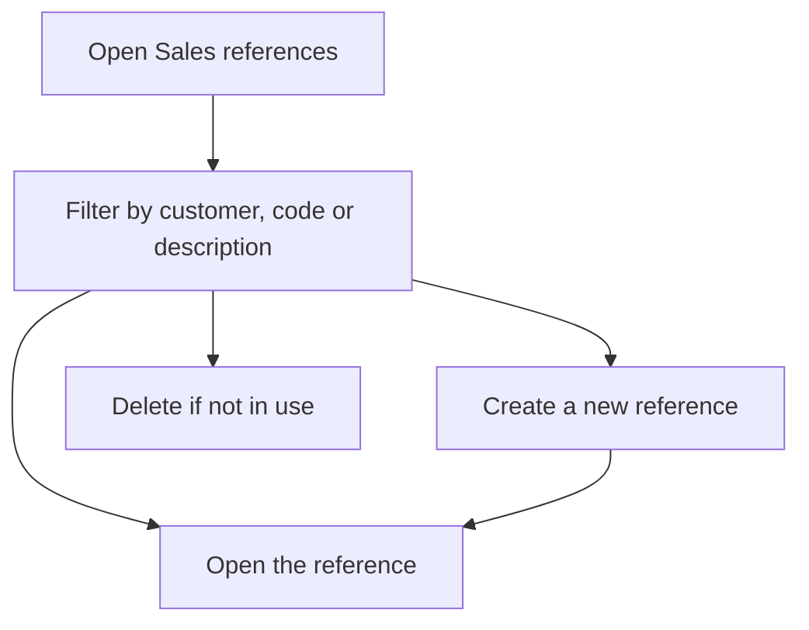

# Sales references

## What this screen is for

This is the catalogue of references you sell: the parts or services that appear on the lines of quotations, sales orders, delivery notes and invoices. Here you search for one, check its attachments and create new ones. Each reference record also lets you define its manufacturing routes.

## Available actions

- Filter by "Customer", "Creation date", "Code" and "Description"; the list filters as you change the filters.
- Clear all filters with "Clear".
- Create a reference with the "+" button ("Create new"): an empty record opens.
- Open a reference by clicking its row.
- View the reference's attached documents with the paperclip icon ("Attachments").
- Delete a reference with the trash icon ("Delete"), after confirming.
- Adjust the columns and save views with the gear icon ("View configuration").

## Usual flow

1. Open "Sales references".
2. Filter by "Customer" or type part of the "Code" or "Description".
3. Check "Version", "Price" and "Cost" in the table.
4. Click the row to open its record, or press "+" to create a new reference.
5. If you need to review drawings or documents, open the attachments with the paperclip.

## Important notes

- Only references flagged for sales are shown. Purchase and production references are managed from their own modules.
- The "Cost" column shows the theoretical manufacturing cost, calculated from the reference's manufacturing route.
- A reference with a "Customer" only appears on the lines of that customer's quotations. References without a customer appear for every customer.
- "Creation date" filters by the date the reference was created.
- A reference that is already in use cannot be deleted: the system blocks it if it has sales or purchase orders, delivery notes, budgets, receipt delivery notes, stock or lots, warehouse movements, a manufacturing route or work orders, if it is part of a bill of materials or a purchase rate, or if it is the external service of a phase. When deletion is allowed, it is permanent.

## Common errors

- If deleting shows "Reference with dependencies:" followed by a list, the reference is in use. Each line gives a reason; for example, "Has a defined production route" means you must first delete the route from the reference record.
- If you cannot find a reference, press "Clear": a customer or date filter may still be applied.
- If the reference exists but does not appear here, it may not be flagged for sales.

## Basic process

