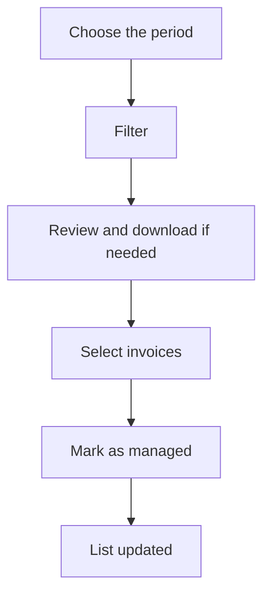

# Sales invoice accounting

## What this screen is for

It is used to close sales invoices administratively for a period: you list them, review them and mark many of them as managed at once, for example once they have been passed to accounting. It does not replace "Sales invoices": invoices are not created or edited here.

## Available actions

- Choose the "Period" on the calendar (start and end date) and click "Filter".
- Tick "Managed" to also include invoices that are already managed.
- Reset with "Clear": it empties the period, unticks "Managed" and empties the list.
- Select invoices with the checkboxes in the first column.
- Mark the selected invoices as managed with the green check-mark button ("Mark as managed").
- Download an invoice in Word with the download icon on its row ("Download invoice").

The table shows the "Number", "Customer", "Status", "Date", "Due date" (the last due date) and "Base amount".

## Usual flow

1. Open "Sales invoice accounting". The list starts empty.
2. Choose the period, for example the month you want to close, and click "Filter".
3. Review the pending invoices and, if needed, download one to check it.
4. Select the invoices you have already processed.
5. Click the "Mark as managed" button. The "Invoices accounted for" message appears with the number of invoices and the list reloads.

## Important notes

- The period filters by invoice date and has no default value: without a period the list does not load and the "Select a period" notice appears.
- By default only invoices that are not yet in the "Gestionada" status are listed. Ticking or unticking "Managed" reloads the list automatically.
- The mark button is only enabled when at least one invoice is selected.
- The action sets the "Gestionada" status directly on every selected invoice, whatever its current status, without going through the lifecycle transitions.
- It depends on the sales invoice lifecycle having a status named exactly "Gestionada" ("Lifecycles"). If it does not exist, the button does nothing.
- To open or change an invoice, use "Sales invoices".

## Common errors

- If "Select a period" appears, choose a start and an end date and click "Filter" again.
- If no invoice appears for a period already closed, tick "Managed": they are probably all managed already.
- If the mark button is disabled, select at least one invoice.
- If nothing happens when you click the button, check in "Lifecycles" that the "Gestionada" status exists.
- If "Error downloading invoice" appears, try again and, if it persists, open the invoice from "Sales invoices" and download it from its screen.

## Basic process

