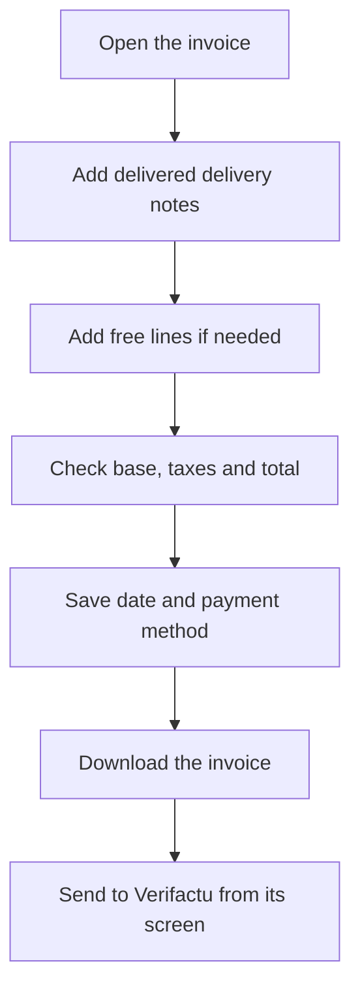

# Sales invoice

## What this screen is for

This is the record of a sales invoice. Here you add the customer's delivered delivery notes or free lines, check the base, taxes and total, download the document and, if needed, create a corrective invoice. It is the last step of the `quotation -> sales order -> delivery note -> invoice` flow; sending it to Verifactu is done afterwards, from another screen.

## Available actions

- Save the header with "Save": "Invoice date", "Status" and "Payment method". After saving, you return to the previous screen.
- Open the arrow menu of the "Save" button to:
  - "Download": the invoice in Word.
  - "Print PDF": the invoice in PDF.
  - "Corrective invoice": opens the "Create corrective invoice" dialog.
- Check the totals on the "Taxable base", "Taxes" and "Invoice total" cards, and the sending status on the "Verifactu" card.
- "Invoice details" tab:
  - Add delivery notes with the "Create delivery note" button: the "Delivery note selector" opens with the customer's delivery notes waiting to be invoiced.
  - Add a free line with "Add line": "Description", "Tax", "Quantity" and "Unit price"; the "Total" is calculated automatically.
  - Delete a free line with the cross on the line.
  - Remove a whole delivery note from the invoice with the cross on its group header.
- "Fiscal data" tab: correct the customer's fiscal data on this invoice and save it with "Save fiscal data".

## Usual flow

1. Create the invoice from "Sales invoices"; this screen opens.
2. Click "Create delivery note", tick the delivered delivery notes you want to invoice and confirm.
3. If you need to invoice something that does not come from a delivery note, add it with "Add line".
4. Check the "Taxable base", "Taxes" and "Invoice total".
5. Check the "Invoice date" and "Payment method" and click "Save".
6. Download the invoice in PDF or Word to send it to the customer.

## Important notes

- Lines are grouped by delivery note. Delivery note lines cannot be deleted one by one: the whole delivery note is removed. No line can be edited: to change a free line, delete it and create it again.
- You can only add delivery notes of the same customer, in the "Entregat" status, with lines and not already on another invoice. Each line takes its reference's tax or, if it has none, 21% VAT.
- When a delivery note is added, its sales orders move to "Comanda Facturada" and the delivery note is locked. When it is removed, the delivery note is free to be invoiced again and the orders go back to "Comanda Servida". Status names are shown exactly as they are defined in the lifecycle.
- The base, taxes and total are recalculated automatically, grouped by tax, every time you add or remove lines or delivery notes.
- Due dates are generated automatically from the payment method and the invoice date: the total is split across the payment method's number of payments. They are recalculated when you save the header and when the lines change. Payment methods are configured on "Payment methods".
- The "Status" drop-down only offers the statuses you can move to from the current one, according to "Lifecycles".
- "Create corrective invoice" always creates a new invoice, with a new number and today's date, that copies all the original lines as negative amounts. If you tick "Create invoice with corrected amount", it also creates a second invoice with a single line for the "Amount to invoice excluding VAT", which cannot exceed the original's base. The original invoice does not change.
- Corrective invoices cannot be modified: the detail buttons are disabled and the menu does not offer "Corrective invoice".
- The "Verifactu" card shows the invoice's sending status. Invoices are not sent from here but from "Invoice Integration to Verifactu".
- The "Fiscal data" tab only appears while the Verifactu status is "Pendent" or "Error". Saving also updates the customer record. If the customer has other pending or failed invoices, the system asks whether to apply the change to them too: "Yes, propagate" updates them all and "Cancel" saves nothing.

## Common errors

- If "Save" does not save, check the "The invoice date is required" and "The payment method is required" messages.
- If the delivery note selector is empty, check in "Delivery notes" that the customer's delivery notes are in the "Entregat" status and not already on another invoice.
- If "A delivery note without lines cannot be invoiced" appears, add sales orders to the delivery note before invoicing it.
- If "VAT 21% tax not found" appears, a 21% tax must be created in "Taxes".
- If the detail buttons are disabled, the invoice is a corrective invoice and cannot be modified.
- If "The entered quantity cannot exceed the invoice quantity" appears when creating the corrective invoice, the corrected amount must be equal to or lower than the original invoice's taxable base.
- If "Invalid CIF/NIF" appears when saving the fiscal data, check the "VAT number".
- If you do not see the "Fiscal data" tab, the invoice's Verifactu status is no longer "Pendent" or "Error", usually because it has already been sent successfully, and its fiscal data can no longer be changed.

## Basic process

