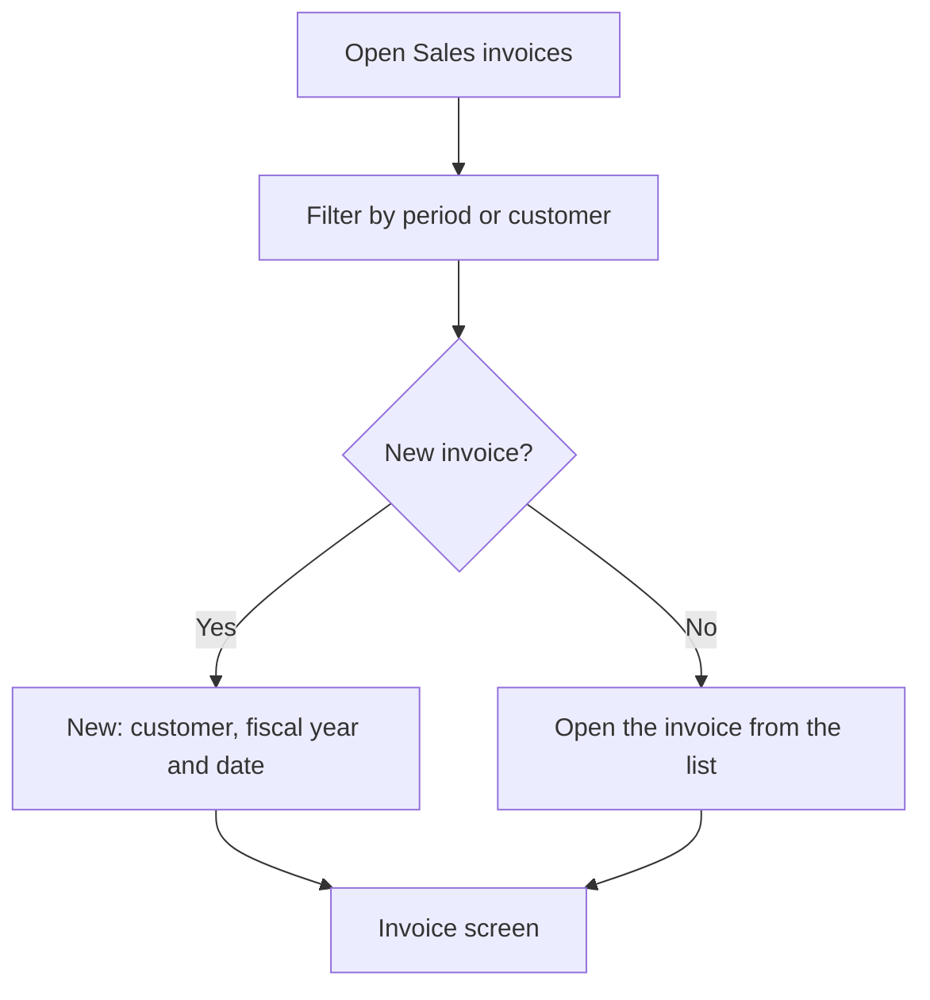

# Sales invoices

## What this screen is for

This is the list of sales invoices. Here you look up the invoices of a period, filter them by customer, open one or create a new one. The invoice is the last document of the sales flow: `quotation -> sales order -> delivery note -> invoice`. To mark many invoices as managed at once, use "Sales invoice accounting".

## Available actions

- Filter by "Period" and "Customer", and apply the filter with "Filter".
- Reset the filters with "Clear": it removes the customer and sets the period back to the current year. Then click "Filter" to reload the list.
- Create an invoice with "New": the "Create invoice" dialog opens, where you choose the "Customer", the "Fiscal year" and the "Date".
- Open an invoice by clicking its row.
- Delete an invoice with the trash icon ("Delete"), after confirming.

The table shows the "Number", "Date", "Customer", "Status", "Due date" (the invoice's last due date) and total "Amount".

## Usual flow

1. Open "Sales invoices". The invoices of the current year load, or the last filters you used.
2. Adjust the period or customer and click "Filter".
3. To invoice deliveries, click "New", choose the customer, check the fiscal year and invoice date, and confirm.
4. Once it is created, the invoice screen opens so you can add delivered delivery notes or free lines.
5. To review or download an existing invoice, click its row.

## Important notes

- The period filters by invoice date. The screen remembers the period and customer when you leave it.
- The "Date" in the dialog is the invoice date. The proposed fiscal year is the one named after the current year, and the invoice number is assigned by the system from that fiscal year's counter.
- When the invoice is created, the customer's fiscal data (name, VAT number, account number and main address) and payment method are copied onto it. Later changes to the customer record do not change the invoice.
- A new invoice starts in the initial status of its lifecycle ("Lifecycles") and in the initial Verifactu status, waiting to be sent.
- The customer must have a tax name, VAT number and account number, and at least one active address, and the company's default site must have complete billing data.
- The trash icon only appears on invoices in the initial status of the lifecycle. Deleting an invoice removes it permanently and releases its delivery notes, which can then be invoiced again.

## Common errors

- If no invoice appears, check that the period has a start and an end date and that the customer filter is right.
- If "Customer is not valid for creating an invoice" appears when creating the invoice, complete the customer's tax name, VAT number and account number in "Customers".
- If "Customer has no addresses registered" appears, add an address to the customer.
- If creation fails with a server error, check that the customer has a payment method assigned.
- If a message says the site is not valid, check the billing data of the company's default site.
- If you do not see the trash icon on an invoice, it is no longer in the initial status.

## Basic process

