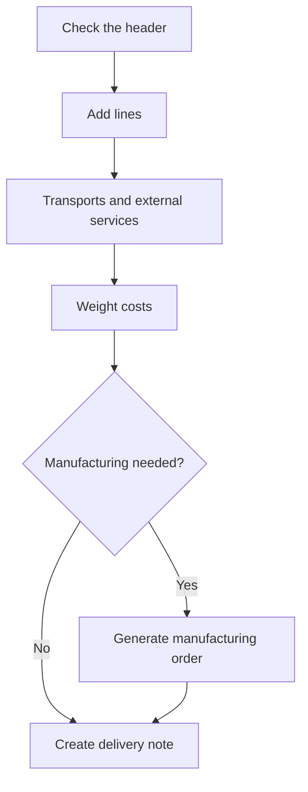

# Sales order

## What this screen is for

This is the record of a sales order. Here you maintain the header, the lines with their costs and prices, the transports, the external services and the attached files. From here you also generate the manufacturing order for each line and create the order's delivery note, within the `quotation -> sales order -> delivery note -> invoice` flow.

## Available actions

- Save the header with "Save". After saving, you return to the previous screen.
- Open the arrow menu of the "Save" button to:
  - "Download": the sales order in Word, with prices.
  - "Print PDF": the sales order in PDF, with prices.
  - "Download without price": the sales order in Word, without prices.
  - "Create delivery note": creates the delivery note with all the order lines and opens it.
- Change the order "Status" with the drop-down.
- Open the customer record with the magnifying glass next to the "Customer" field.
- "Details" tab: add lines with "Add line", edit a line by clicking it, delete it with the cross, and spread costs with "Weight costs".
- In the "Manufacturing order" column of each line: generate its manufacturing order with the "+" button, or open the order already generated with the button that shows its code.
- "Transports" tab: add them with "Add transport" and edit them by clicking them.
- "External services" tab: choose the "Supplier" of each external service.
- "Files" tab: upload, preview, download and delete documents of the order.

## Usual flow

1. Check the header: "Customer", "Customer order", "Registration date" and "Delivery date".
2. On "Details", click "Add line", choose the "Reference" and, if it has one, the "Manufacturing route"; adjust the "Quantity", margins and "Discount" and save the line.
3. If needed, add the transports and choose the supplier of the external services; then click "Weight costs".
4. For each line that has to be manufactured, click "+" under "Manufacturing order", check the route, quantity and "Expected date", and generate the order.
5. When the order is ready to ship, choose "Create delivery note" in the "Save" menu.
6. Download the document with or without prices if you need to send it to the customer.

## Important notes

- "Sales order no.", "Quotation no." and "Delivery note" are read-only. The last two show the source quotation and the delivery note that contains the order.
- The "Status" drop-down only offers the statuses you can move to from the current one, according to the lifecycle configured on "Lifecycles".
- The system also changes the order status on its own: it moves to "Comanda Servida" when its delivery note is delivered, to "Comanda Facturada" when the delivery note is added to an invoice, and back to "Comanda" if it is removed from the delivery note. Status names are shown exactly as they are defined in the lifecycle.
- Once the order is on a delivery note, its lines are locked: "Add line", "Weight costs" and "Add transport" disappear, lines cannot be opened or deleted, and the "+" button for manufacturing orders is disabled.
- A line with a manufacturing order, or one already delivered, cannot be deleted: the cross does not appear.
- In the line dialog, "Reference" only lists this customer's references and those that belong to no customer. Choosing one fills in the description, price and cost; if the reference has a single active manufacturing route, it is selected automatically and the costs come from the route. The "Margins" tab lets you adjust the profit per phase.
- "Weight costs" spreads the transport price across the lines by weight and the external services price according to the supplier's purchase rate, and then recalculates each line's "Unit price" and total from cost, profit and discount. Prices you edited by hand are overwritten.
- External services are calculated by the system from the external phases of the lines' routes. When you choose the supplier, the price is calculated from its rate and saved without clicking "Save".
- On the lines, "Theoretical unit cost" and "Theoretical cost" come from the manufacturing route, and "Actual unit cost" and "Actual cost" from the manufacturing order already carried out.
- The sales order does not move stock. Stock leaves the warehouse when the delivery note moves to the "Entregat" status.
- "Create delivery note" creates the delivery note with today's date, in the fiscal year of the current date and in the initial status. An order can only be on one delivery note.

## Common errors

- If "The date cannot be empty" appears when saving, fill in the "Registration date".
- If "Create delivery note" warns "This document already has an associated document", the order is already on a delivery note: find it in "Delivery notes" by the number shown in "Delivery note".
- If "Create delivery note" fails with "No exercise found for the current date", the current year's fiscal year must be created in "Fiscal years".
- If you cannot edit or delete lines, check whether the order already has a delivery note. As long as that delivery note is neither delivered nor invoiced, you can remove the order from it on the delivery note screen.
- If "The manufacturing route is required" appears when generating the manufacturing order, the reference has no active route: create or activate one first.
- If "Costs could not be weighted." appears, check that the order has lines.

## Basic process

