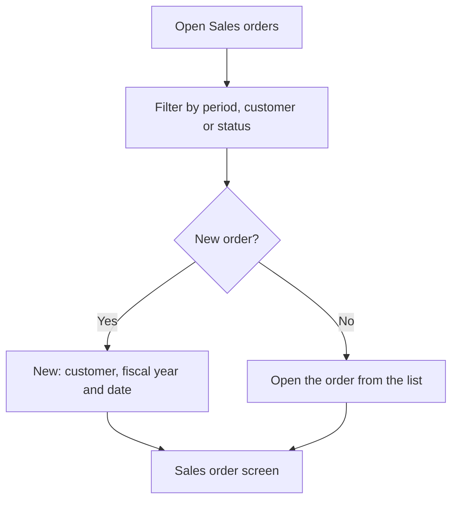

# Sales orders

## What this screen is for

This is the list of sales orders. Here you look up the orders of a period, filter them by customer or status, open one or create a new one. The sales order is the second step of the sales flow: `quotation -> sales order -> delivery note -> invoice`. A sales order can also be created from a quotation, on the "Quotations" screen with "Create sales order".

## Available actions

- Filter by "Period", "Customer" and "Status", and apply the filter with "Filter".
- Reset the filters with "Clear": it removes the customer and status, sets the period back to the current year and reloads the list.
- Create a sales order with "New": the "Create sales order" dialog opens, where you choose the "Customer", the "Fiscal year" and the "Date".
- Open a sales order by clicking its row.
- View the files attached to a sales order with the paperclip icon ("Attachments"), without leaving the list.
- Delete a sales order with the trash icon ("Delete"), after confirming.

The table shows the "Number", "Date", "Delivery date", "Customer", "Customer order" (the customer's own order reference) and "Status".

## Usual flow

1. Open "Sales orders". The orders of the current year load, or the last filters you used.
2. Adjust the period, customer or status and click "Filter".
3. For a new order, click "New", choose the customer, check the fiscal year and date, and confirm.
4. Once it is created, the sales order screen opens directly so you can add the lines.
5. To review or continue an existing order, click its row.

## Important notes

- The period filters by the order date. Without a complete period (start and end date) the list does not load and the "Select a period" notice appears.
- The screen remembers the period, customer and status when you leave it and restores them when you come back.
- The proposed fiscal year is the one named after the current year. The order number is assigned by the system from that fiscal year's counter.
- A new sales order starts in the initial status of the sales order lifecycle, which is configured on "Lifecycles".
- The customer must have a tax name, VAT number and account number, and at least one active address. The company's default site must also have complete billing data (address, city, postal code, region, country and VAT number).
- The trash icon only appears on orders that are in the initial status of the lifecycle.
- Deleting a sales order removes it permanently. If the order came from a quotation, the quotation goes back to its initial status and loses its acceptance date, so it can be converted into an order again.

## Common errors

- If "Select a period" appears, enter a start and an end date and click "Filter" again.
- If "Customer is not valid for creating an invoice" appears when you create the order, complete the tax name, VAT number and account number on the customer record, in "Customers".
- If "Customer has no addresses registered" appears, add an address to the customer.
- If a message says the site is not valid, check the billing data of the company's default site.
- If you do not see the trash icon on an order, it is no longer in the initial status: change its status from the order screen if needed.

## Basic process

