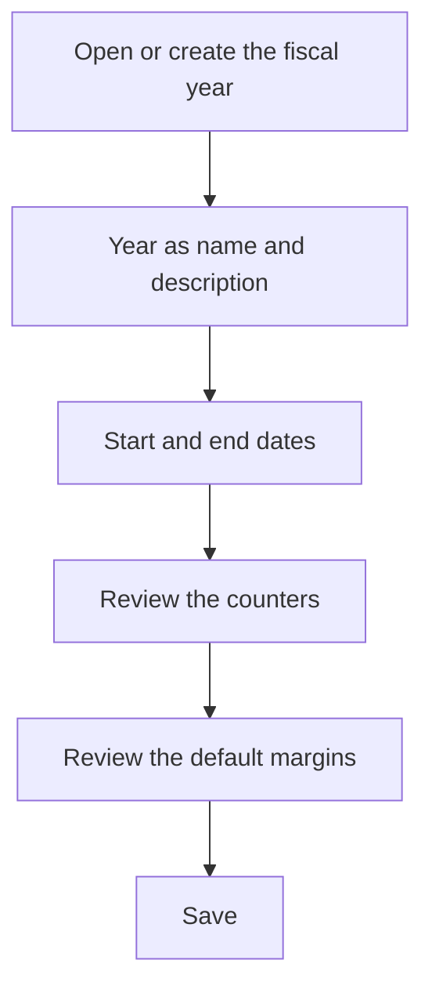

# Fiscal year

## What this screen is for

This is the record of a fiscal year. Here you set its date range, the counters used to number its documents, and the default margins for new lines. Every sales and purchase document numbered in this fiscal year takes its number from here: quotation, sales order, delivery note and sales invoice, as well as purchase order, purchase delivery note and purchase invoice.

## Available actions

- Fill in "Name", "Description", "Start date" and "End date".
- Adjust the counters: "Budgets", "Sales orders", "Sales delivery notes", "Sales invoices", "Purchase orders", "Reception delivery notes" and "Purchase invoices".
- Set "Default material margin (%)" and "Default external margin (%)".
- Check "Disabled" when the fiscal year is no longer needed.
- Save with "Save" in the header. Saving takes you back to the previous screen.

## Usual flow

1. From "Fiscal years", click "+" or open the fiscal year you want to review.
2. Enter the year as the name, for example "2027", and a description.
3. Set the fiscal year's start and end dates.
4. In a new fiscal year, leave the counters empty or at 0 so numbering starts at 1.
5. Check the default margins.
6. Click "Save".

## Important notes

- "Name", "Description", "Start date" and "End date" are required, and the end date must be after the start date. Two fiscal years cannot share the same name.
- Each counter stores the last number used for that document type, with three digits. The next document number is the last two digits of the fiscal year name followed by the counter plus one. For example, in fiscal year "2026" with "Sales invoices" at 041, the next invoice is 26042 and the counter becomes 042.
- This is why the name must end in two digits (the year) and the counters may only contain digits.
- The counter has three digits: past the 999th document of a type within the fiscal year, numbering is no longer correct.
- Changing a counter changes the next document number. Do not set it below the last number issued: saving the fiscal year does not check this, and numbers could repeat.
- Manufacturing orders are also numbered with a fiscal year counter that is not shown on this form.
- When you create a document by hand, you choose the "Fiscal year" in the create dialog (the one named after the current year is preselected). When a document is generated automatically, the system uses the fiscal year that contains the date: today's date for sales orders from quotations and delivery notes from sales orders, the planned date for manufacturing orders, and the invoice date for purchase invoices.
- The default margins are proposed on new lines of quotations and sales orders in this fiscal year. The external margin is also proposed when a phase of a manufacturing route is marked as external work, using the fiscal year in force today. A new fiscal year starts at 30% for both.
- If you leave a margin at 0, new lines still propose 30%.
- A disabled fiscal year cannot be used to create purchase invoices.

## Common errors

- If saving shows "End date must be after the start date", check "Start date" and "End date".
- If saving a new fiscal year fails, check that no other fiscal year has the same name.
- If creating a document shows "Error creating counter" or an unexpected error, check that the fiscal year name ends in two digits and that the counter for that document contains only digits.
- If "No exercise found for the current date" appears, check the fiscal year's dates: the document date must fall between the start and the end.

## Basic process

