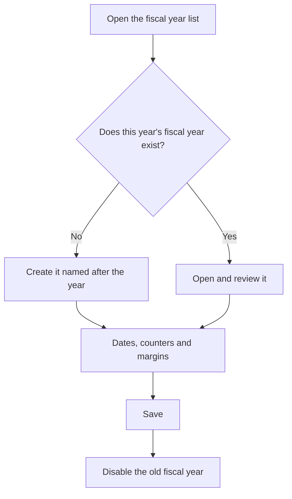

# Fiscal years

## What this screen is for

Lists the fiscal years, the date ranges (usually one calendar year) the company uses to number its documents. Each fiscal year has its own counters for quotations, orders, delivery notes and invoices, plus the default margins proposed on new lines. There must be a fiscal year covering the dates on which documents are created; otherwise the system cannot number them.

## Available actions

- Review the name, description, "Start date", "End date" and whether the fiscal year is "Disabled".
- Create a new fiscal year with the green "+" button ("Create new").
- Open a fiscal year by clicking its row to review its counters or dates.

## Usual flow

1. Before the year starts, open the fiscal year list.
2. Click "+" to create the new fiscal year.
3. Name it after the year, for example "2027", and set the year's start and end dates.
4. Check the counters and default margins, then save it.
5. When the previous fiscal year is no longer needed, open it and mark it "Disabled".

## Important notes

- Name the fiscal year after the four-digit year. Document numbers start with the last two digits of the name, and several screens preselect the fiscal year whose name matches the current year.
- Create next year's fiscal year before it starts. When the system generates a document automatically (a sales order from a quotation, a delivery note from a sales order, or a manufacturing order), it looks for the fiscal year that contains the date; if there is none, the document is not created.
- Do not let two fiscal years overlap: when the system looks up the fiscal year for a date, it takes only one.
- This screen does not delete fiscal years. To stop using one, mark it "Disabled".
- A purchase invoice cannot be created if the fiscal year containing the invoice date is disabled.
- The counters and margins are explained in the help of the "Fiscal year" record.

## Common errors

- If creating a document shows "No exercise found for the current date", create the fiscal year that contains today's date or check the dates of the existing one.
- If creating a purchase invoice shows "Invalid exercise", check that a fiscal year contains the invoice date and that it is not "Disabled".
- If no fiscal year is preselected when you create a document, check that one is named after the current year.

## Basic process

