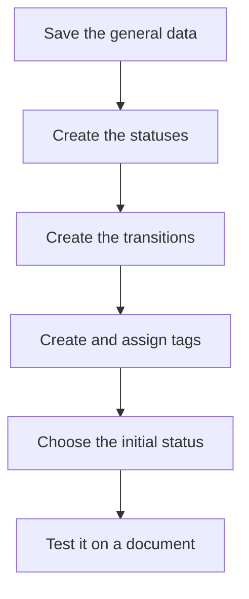

# Lifecycle

## What this screen is for

Configures a lifecycle: the statuses a document type goes through, the transitions that allow moving from one status to another, and the tags that give some statuses a special meaning. Transitions decide which statuses appear in each document's status dropdown, and tags decide, for example, which work orders can be planned or loaded at the plant. It is a configuration screen for the administrator.

## Available actions

- Edit the lifecycle's "Name", "Description" and "Initial status", and save them with "Save".
- On the "States & Transitions" tab, add a status with the "+" button of the "Statuses" table, or click its row to change its "Name", "Color", the "Disabled" checkbox and its "Tags".
- Delete a status with the "X" on its row. The "X" only appears when the status is not part of any transition.
- On the same tab, add a transition with the "+" button of the "Transitions" table, setting its "Name", "Origin" and "Destination". Click the row to edit it, or the "X" to delete it.
- On the "Tags" tab, create tags with the "+" button (with "Name", "Description", "Color" and "Icon"), edit them with the pencil or delete them with the trash icon.

## Usual flow

1. Open the lifecycle from "Lifecycle management".
2. On "States & Transitions", create the missing statuses and choose each one's "Color".
3. Create the transitions: one for each allowed step, from the "Origin" status to the "Destination" status.
4. If the lifecycle needs them, create tags on "Tags" and assign them to statuses from each status dialog.
5. Choose the "Initial status" and save with "Save".
6. Open a document of this type and check that the status dropdown offers the expected changes.

## Important notes

- **Status names drive the application's behavior.** Many automatic processes look up statuses by their exact name, as written (the names are the original Catalan ones). For example, "Acceptat" and "Rebutjat" for budgets; "Comanda", "Comanda Servida" and "Comanda Facturada" for sales orders; "Entregat" for delivery notes; "Cobrada" for invoices; "Recepcionat" for receipts; "Rebuda", "Rebuda parcialment", "Pendent de rebre" and "Cancel·lada" for purchases; and "Creada", "Llançada", "Producció", "Pausa", "Tancada", "Servei Extern" and "Cancel·lada" for work orders. Do not rename them: these automations (warehouse movements, chained status changes, closing phases, dashboards) would stop working or report "Status with ID ... not found or is disabled".
- **Do not rename the lifecycle either**: the application looks it up by its internal name.
- **Transitions**: a document's status dropdown only offers the destination statuses of the transitions that leave its current status. If a transition is missing, users cannot make that change. At the plant, when a phase is closed or paused, the application looks for a transition from the current status to "Tancada" or "Pausa".
- **"Disabled"**: a disabled status is no longer offered as a destination in status dropdowns. Documents already in it do not change. To retire a status, disable it instead of deleting it.
- **"Initial status"**: the status new documents receive. Without it, creating those documents fails. In the work order lifecycle, work orders in the initial status also move to "Llançada" when they are prioritized.
- **"Color"**: the color the status shows with in document lists. Choose it by meaning: "In progress", "Needs action", "Done", "Problem", "Closed", "Neutral" or "No colour".
- **Tags with a special meaning** in the work order lifecycle: work orders in statuses tagged `Available` are the ones that can be planned and count toward machine load (if no status has it, only work orders in the initial status are planned); `Plant` makes the work order's phases appear on plant machines so they can be loaded; `ExternalService` makes the work order's external phases appear in "Purchase order generation". The tag name must match exactly.
- Tags belong to one lifecycle and cannot be repeated within it. The "Tags" selector in the status dialog only appears when the lifecycle has tags.
- **Deletions**: deleting statuses, transitions and tags is permanent and does not ask for confirmation. Deleting a tag removes it from every status that had it. Never delete a status that has documents: the database may reject the deletion or delete the documents in that status along with it.
- In a new lifecycle, first save the general data with "Save": until then you cannot add statuses or transitions.

## Common errors

- If you cannot delete a status and "Status ... is part of a transition" appears, first delete the transitions where it appears. Think it over: disabling it with "Disabled" may be the better option.
- If saving a transition shows "Origin and destination statuses must be different", check the "Origin" and "Destination".
- If a user cannot find a status in a document's dropdown, check that there is a transition from the document's current status and that the destination status is not "Disabled".
- If saving a tag reports that a tag with that name already exists, choose another name or edit the existing tag.
- If an automatic process fails with "Status with ID ... not found or is disabled" after a status was renamed, restore its original name exactly.
- If work orders do not appear in planning or on plant machines, check that the relevant statuses have the `Available` or `Plant` tag.

## Basic process

