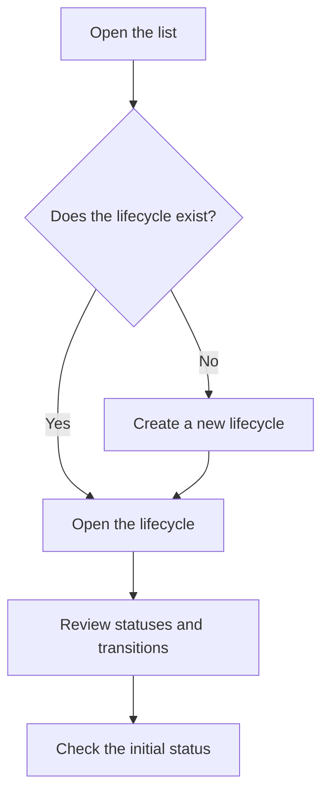

# Lifecycle management

## What this screen is for

Lists the application's lifecycles. Each lifecycle defines the statuses a document type goes through and the transitions allowed between them: budgets, sales orders, delivery notes, invoices, purchase orders, receipts, work orders and the submission to Verifactu. It is a configuration screen for the administrator: what you change here affects every document of that type.

## Available actions

- Review each lifecycle with its "Name", "Description" and "Initial Status".
- Create a new lifecycle with the "+" button ("Create new").
- Open a lifecycle by clicking its row to edit its statuses, transitions and tags.
- Delete a lifecycle with the trash icon on its row.

## Usual flow

1. Open the list and find the lifecycle of the document you want to review (for example, the work order one).
2. Click the row to open it.
3. Review or adjust the statuses, transitions and tags on the detail screen.
4. Go back to the list and check that the "Initial Status" column shows the expected status.

## Important notes

- The application looks up each lifecycle by its internal name (for example `Budget`, `SalesOrder`, `DeliveryNote`, `SalesInvoice`, `PurchaseOrder`, `PurchaseOrderDetail`, `PurchaseInvoice`, `Receipts`, `WorkOrder` or `Verifactu`). Do not rename or delete these: documents of that type could no longer be created or change status.
- Creating a new lifecycle with a different name does not make any document use it: documents only use the lifecycles with the name the application expects.
- The "Initial Status" column is the status new documents receive. If it is empty, creating those documents fails.
- A lifecycle can only be deleted when it has no statuses and no transitions. Deletion is permanent and does not ask for confirmation.

## Common errors

- If deleting shows "Lifecycle ... has dependencies", the lifecycle still has statuses or transitions. This usually means it is in use: do not delete it.
- If creating a lifecycle reports that the entity already exists, there is already one with the same name.
- If creating a document reports that the lifecycle has no initial status, open that lifecycle and set its "Initial status".

## Basic process

