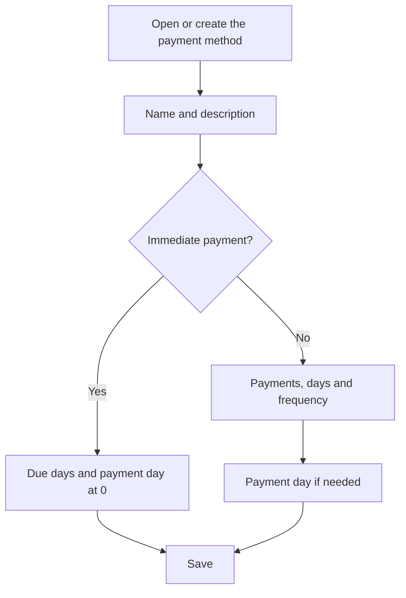

# Payment method

## What this screen is for

This is the record of a payment method. Here you define how an invoice amount is split into due dates and when they fall due. The payment method is assigned to the customer or supplier and to each invoice, and the system calculates the due dates from the invoice date and total amount.

## Available actions

- Fill in "Name" and "Description" to identify the payment method in selectors.
- Define how due dates are calculated with "Due days", "Payment day", "Number of payments" and "Frequency".
- Check "Disabled" so it is no longer offered on customers and invoices.
- Save with "Save" in the header. Saving takes you back to the previous screen.

## Usual flow

1. From "Payment methods", click "+" or open an existing payment method.
2. Type the name and description, for example "30-60-90" and "Three payments at 30, 60 and 90 days".
3. Enter the number of payments and the days between due dates.
4. If payments must be made on a set day of the month, enter it in "Payment day"; otherwise leave 0.
5. Click "Save".

## Important notes

- Every field is required except "Disabled". "Name" and "Description" accept up to 250 characters.
- Immediate payment: if "Due days" and "Payment day" are both 0, the invoice gets a single due date for the full amount on the invoice date.
- Otherwise the system creates as many due dates as "Number of payments". The total is split evenly and each part is rounded to cents, so the sum can be off by one cent.
- Each due date is calculated from the previous one (the first from the invoice date) by adding the "Frequency" days. If "Frequency" is 0, the "Due days" are added instead.
- Watch out: when "Frequency" is greater than 0, the first due date also uses the frequency and "Due days" is ignored.
- If the days are a multiple of 30 (30, 60, 90...), whole months are added instead of days. An invoice dated March 15 at 30 days falls due on April 15.
- If "Payment day" is greater than 0, each due date moves to that day of the month: the same month if it has not passed yet, or the next month if it has. If the month has no such day (for example, the 31st in February), the last day of the month is used.
- Example: an invoice dated March 15 at 30 days with payment day 10 falls due on May 10, because April 15 is already past the 10th.
- A new payment method starts with "Payment day" set to 1. For immediate payment, set it to 0.
- A sales invoice's due dates are recalculated each time the invoice is saved. On purchase invoices they are proposed automatically once the invoice has a supplier, a payment method and a tax on every amount line.

## Common errors

- If an invoice ends up with no due dates, check that "Number of payments" is at least 1.
- If due dates land a month later than expected, check "Payment day": when that day has already passed, the due date moves to the next month.
- If the first due date ignores "Due days", check "Frequency": when it is not 0, it takes precedence.
- If a purchase invoice shows "Payment method with ID ... not found or is disabled", the payment method is disabled. Enable it again or choose another one on the invoice.

## Basic process

