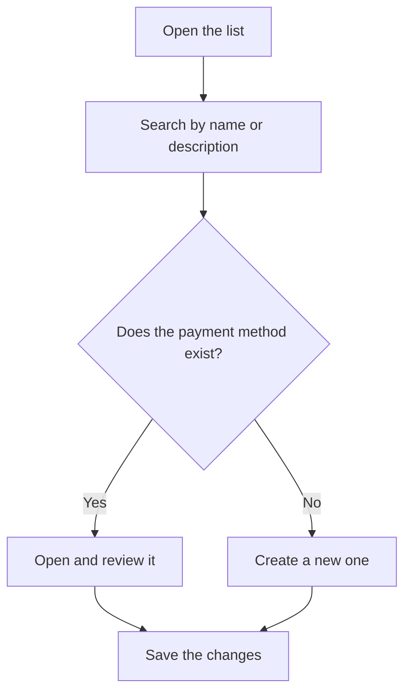

# Payment methods

## What this screen is for

Lists the payment methods assigned to customers, suppliers and invoices. Each payment method decides how an invoice's due dates are calculated: how many payments there are, how many days apart, and on which day of the month. From here you review their setup at a glance and create new ones. Each field is explained in the help of the "Payment method" record.

## Available actions

- Search by name or description with the "Search" filter. The list filters as you type.
- Clear the search with the "Clear filters" button.
- Create a new payment method with the green "+" button ("Create new").
- Open a payment method by clicking its row to review or change it.

## Usual flow

1. Open the payment method list.
2. Type part of the name or description in "Search" to find the one you need.
3. Check the "Due days" and "Payment day" columns to see how each payment method falls due.
4. If none fits, click "+" to create a new one.
5. Fill in the record and save it; you return to the list with the change applied.

## Important notes

- The list shows every payment method sorted by name, including disabled ones. The "Disabled" column shows which ones are.
- This screen does not delete payment methods. To stop using one, open it and check "Disabled".
- Disabled payment methods are not offered when choosing the payment method on a customer record or on sales and purchase invoices.
- Changing a payment method does not change due dates that were already calculated. A sales invoice's due dates are recalculated each time the invoice is saved, and from then on they use the new setup.

## Common errors

- If you cannot find a payment method, clear the search with "Clear filters": the filter only looks at the name and description.
- If a payment method does not appear in a customer or invoice selector, check that it is not marked "Disabled".
- If an invoice's due dates are not what you expected, open the payment method and check "Due days", "Payment day", "Number of payments" and "Frequency".

## Basic process

