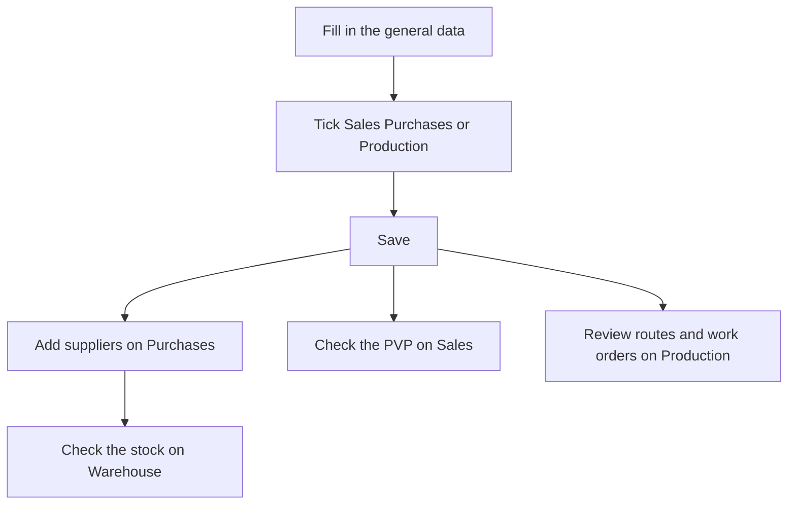

# Reference

## What this screen is for

The unified detail screen of a reference. It brings together on one screen what the "Sales references" and "Purchase references" detail screens show separately: the general data, the sales price, the suppliers and their rates, the manufacturing routes and work orders, and the stock by location. The "Sales", "Purchases" and "Production" checkboxes decide where the reference is used and which tabs are shown.

## Available actions

- **"General"**: fill in the "Code", "Description", "Version", "Material type", "Format", "Customer", "Tax" and "PVP" (the sales price), tick the "Active", "Sales", "Purchases", "Production", "Service" and "Requires lot" checkboxes, and save with "Save".
- On "General", upload, view and delete files under "Documentation" (only once the reference has been created).
- **"Sales"**: change the "PVP" and save it with "Save RRP", and review the "Sales history (delivery notes)".
- **"Purchases"**: check the "LPC (last purchase cost)" and the sub-tabs:
  - "Suppliers & rates": add a supplier with "+", edit it with the pencil or delete it with the "X".
  - "External service rates": review the purchase rate lines of the suppliers that include this reference.
  - "Transport rates": review the transport rates of the assigned suppliers.
  - "Purchase history": review the receipt lines for this reference.
- **"Production"**: review the reference's "Manufacturing routes" and "Work orders", and open them by clicking the row.
- **"Warehouse"**: review the "Stock by location", with the warehouse, location, quantity and dimensions (width, length, height, diameter and thickness).

## Usual flow

1. Create the reference from "Reference management" or open an existing one.
2. On "General", fill in the code, description, version and tax, and tick "Sales", "Purchases" or "Production" as needed.
3. Save with "Save". For a new reference, the other tabs appear at this point.
4. If it is purchased, go to "Purchases" > "Suppliers & rates" and add the suppliers with their code, price and delivery days.
5. If it is sold, check the "PVP" on "Sales".
6. If it is manufactured, review the routes and work orders on "Production", and open the route to check its costs.

## Important notes

- **Tabs by use**: "Sales", "Purchases" and "Production" only appear once the reference has been created and the matching checkbox is ticked; "Warehouse" appears whenever the reference exists. Each tab's data is loaded when the screen opens: if you tick a new checkbox, save and reopen the reference to see its data.
- **Category**: this screen does not let you choose the category. New references are created as products; materials, tools and services are created in "Purchase references". If you open an existing material here, it keeps its category.
- **Versions**: the same reference can have several versions with the same code. Sales references are shown with the code followed by "(v. version)". A new reference starts at version "1".
- **Code with type**: if the reference is for purchases but not for sales and has a "Material type", saving appends the type name in parentheses to the end of the code.
- **Automatic costs**: the "Theoretical Manufacturing Cost" and the "Last Manufacturing / Purchase Cost" cannot be edited. The first is updated every time a manufacturing route of the reference is saved, with that route's costs; the second, when a work order for this reference is updated or a receipt containing it is saved. The "LPC (last purchase cost)" on the "Purchases" tab shows this same value.
- **Receipts and suppliers**: when a receipt is saved, the application updates the supplier's price for this reference and, if the supplier was missing, adds it to "Suppliers & rates". For materials whose "Format" is not the units format, the stored price is per kilogram.
- **"Save RRP"** saves the whole reference, not only the price: pending changes on the "General" tab are saved too.
- **Rates**: external service and transport rates are read-only here. They are maintained on the supplier's detail screen, on the "Purchase rates" and "Transport rates" tabs.
- **Production**: routes and work orders are read-only here. To create a new manufacturing route, use the reference's detail screen in "Sales references". The "Total WO cost" adds up operator, machine and material costs.
- **"Requires lot"**: when ticked, the application assigns a lot to the incoming and outgoing movements of this reference (work orders, receipts and delivery notes) for traceability.
- **Stock**: the "Warehouse" tab is read-only. Stock is moved by documents (receipts, work orders and delivery notes), not by this screen.
- **Documentation**: the files are the same ones shown on the "Sales references" detail screen.
- **Activating and deactivating**: this screen does not delete references. To retire one, clear "Active" and save.

## Common errors

- If the "Sales", "Purchases" or "Production" tab is missing, check that the matching checkbox is ticked and that the reference has been saved.
- If saving shows an error, check that the "Code", "Description" and "Version" are filled in. The "Version" allows at most 10 characters and the "Code" 50.
- If the code changed on save and now ends with text in parentheses, it is the "Material type" added to purchase-only references.
- If saving a supplier shows "Select a supplier", choose one in the "Supplier" dropdown.
- If the histories or rates are empty right after ticking a checkbox, save and reopen the reference.
- If "Transport rates" is empty, check that the reference has suppliers under "Suppliers & rates" and that those suppliers have transport rates.

## Basic process

