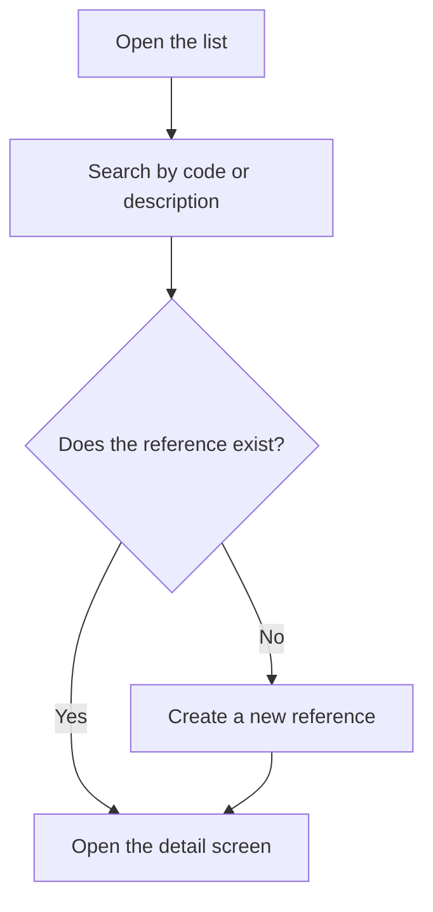

# Reference management

## What this screen is for

Lists every company reference in one place, whether it is used for sales, purchases or production. Unlike "Sales references" and "Purchase references", which only show their own part, this list shows them all together and opens a unified detail screen with tabs for sales, purchases, production and warehouse.

## Available actions

- Search by code or description with the "Search..." field.
- Clear the search with the "Clear filters" button.
- Sort by "Code" or "Description" by clicking the column header.
- Check in the "Sales", "Purchases" and "Production" columns where each reference is used, and in "Active" whether it is active.
- Create a new reference with the "+" button ("Create new").
- Open a reference by clicking its row.

## Usual flow

1. Type part of the code or description in "Search...".
2. Check the "Version" and the "Sales", "Purchases" and "Production" columns to find the right reference.
3. Click the row to open its detail screen.
4. If it does not exist, create it with the "+" button and fill in the general data.

## Important notes

- The list includes references of every category: products, materials, tools and services.
- The search only looks at the code and description, and is not case-sensitive.
- The same reference can have several versions: each version has its own row with the same code.
- References cannot be deleted from this list. To retire one, clear "Active" on its detail screen; the reference stays in the list with "Active" unchecked.
- New references created here are products. To create purchase materials, tools or services, use "Purchase references".

## Common errors

- If you cannot find a reference, clear the search and try a shorter part of the code or description.
- If you see two rows with the same code, check the "Version" column: they are different versions of the same reference.
- If a reference code ends with a suffix in parentheses, it is the material type the application adds to purchase-only references.

## Basic process

