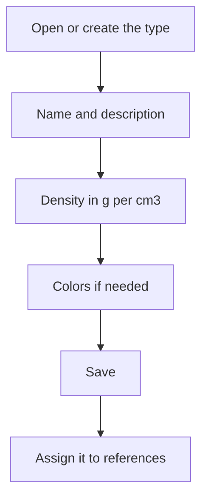

# Material type

## What this screen is for

This is the record of a material type. Here you set its name, its description and, above all, the material's density. Raw material references with this type in their "Material type" field use this density to turn dimensions into weight, and prices and costs are derived from that weight.

## Available actions

- Fill in "Name" and "Description".
- Enter the material's "Density g/cm^3".
- Pick a "Primary Color" and a "Secondary Color" with the color picker.
- Check "Disabled".
- Save with "Save" in the header. Saving takes you back to the previous screen.

## Usual flow

1. From "Raw material types", click "+" or open the type you want to review.
2. Enter the name and description, for example "INOX" and "Stainless steel".
3. Enter the density in g/cm³, for example 7.93.
4. Pick the colors if needed.
5. Click "Save".

## Important notes

- "Name" and "Description" are required and accept up to 250 characters. In the "Material type" selector on references, the type is shown as "name - description".
- Density is entered in g/cm³ with a decimal point. Dimensions are entered in millimeters and, with the density in this unit, the weight comes out in kilograms.
- On material lines of "Purchase delivery notes", the unit weight is calculated from the line's dimensions, the reference's format (plate, round bar or tube) and the density. The line price is the price per kilogram multiplied by the weight.
- On quotations, each line's weight is calculated from the density and the volume of the manufacturing route.
- The actual material cost of manufacturing orders is also calculated from the weight when the reference has a plate, round bar or tube format.
- If you change the density, calculations made from then on use the new value; weights already calculated do not change.

## Common errors

- If calculating the weight of a purchase delivery note line shows "Reference without type", assign a material type to the reference.
- If a message says the dimensions and density must be greater than 0, check that the type's density is not 0 and that the line has all its dimensions.
- If weights come out a thousand times too large or too small, check that the density is in g/cm³ (for example 7.85 for steel, not 7850).

## Basic process

