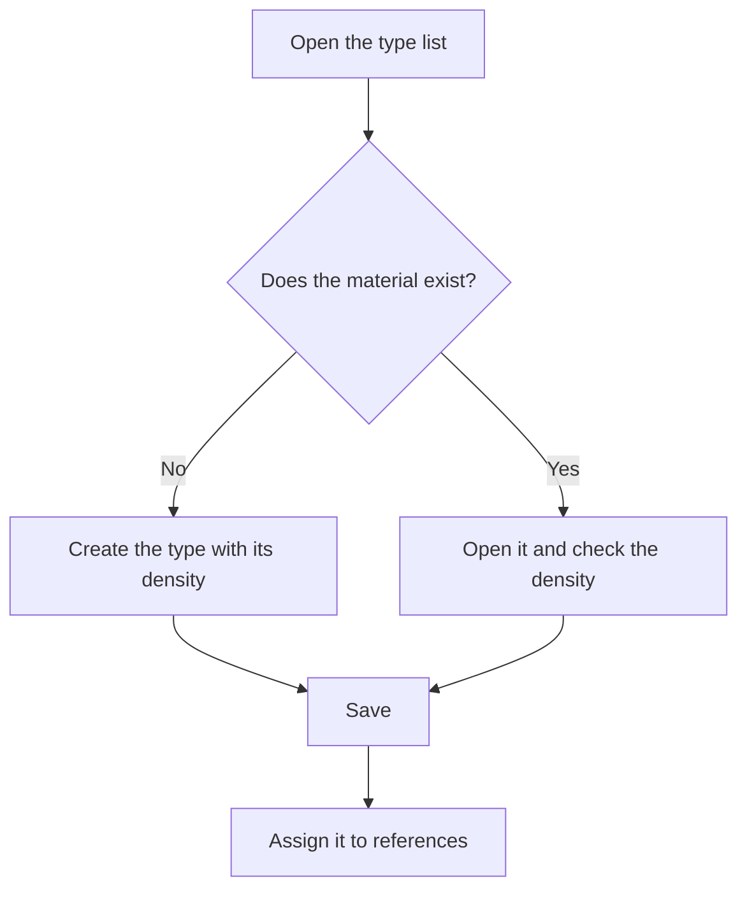

# Raw material types

## What this screen is for

Lists the material types (for example, steel, aluminum or brass) used to classify raw material references. Each type stores the material's density, which the system uses to calculate weights from dimensions: on purchase delivery note lines, on quotations and in the material cost of manufacturing orders. The type is assigned to each reference in the "Material type" field of its record.

## Available actions

- Review the name, description, density and whether the type is "Disabled".
- Sort the list by "Name" or "Description" by clicking the column header. By default it is sorted by name.
- Create a new type with the green "+" button ("Create new").
- Open a type by clicking its row to change it.
- Delete a type with the trash icon on its row, then confirm.

## Usual flow

1. Open the material type list.
2. Check whether the material you need already exists.
3. If it does not, click "+" and create it with its density.
4. Save it; you return to the list with the new type.
5. Assign the type to references from the "Material type" field of the reference record.

## Important notes

- Density is stored in g/cm³, the unit shown on the type record, even though the column header shows a different unit.
- Deleting is permanent. A type assigned to any reference cannot be deleted: change it on those references first.
- Marking a type as disabled does not hide it from the "Material type" selector on references.
- When a type is deleted successfully, the "Deleted" message appears and the list reloads.

## Common errors

- If you cannot delete a type, check whether any reference has it in its "Material type" field and change it there first.
- If a material's calculated weight is wrong, open the reference's type and check its density.

## Basic process

