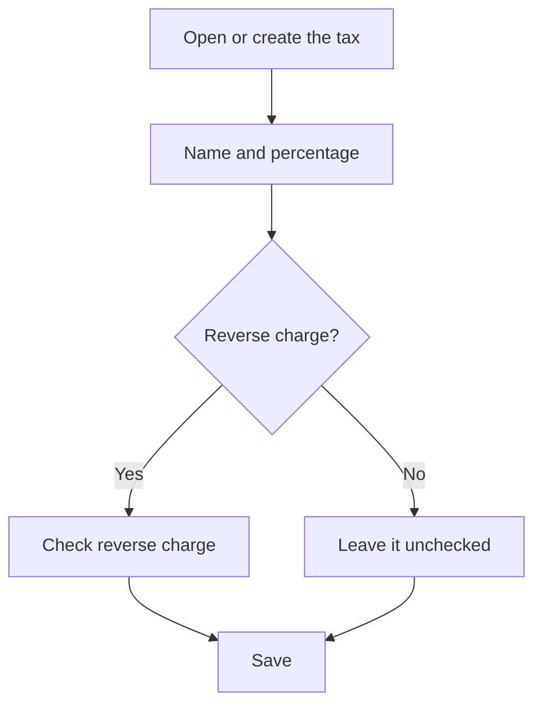

# Tax

## What this screen is for

This is the record of a tax. Here you set its name, its percentage and whether it is a reverse charge tax. This tax is then chosen on sales invoice lines, purchase invoice amounts and reference records, and it determines the tax amount of each invoice.

## Available actions

- Fill in "Name" and "Percentage".
- Check "Reverse charge (RC)" for taxes whose amount is not charged on the invoice.
- Check "Disabled" so it is no longer offered on invoices.
- Save with "Save" in the header. Saving takes you back to the previous screen.

## Usual flow

1. From "Taxes", click "+" or open the tax you want to review.
2. Enter a clear name, for example "VAT 21%".
3. Enter the percentage.
4. If it is a reverse charge tax, check "Reverse charge (RC)".
5. Click "Save".

## Important notes

- "Name" and "Percentage" are required. The name accepts up to 250 characters. Type percentage decimals with a period.
- The tax amount is the base multiplied by the percentage and divided by 100.
- If the tax is a reverse charge tax, the tax amount is always 0, whatever the percentage. In Verifactu, these lines are reported as reverse charge with a zero tax amount.
- On sales invoices, amounts are grouped by tax: each different tax on the lines gets its own base and tax amount.
- Invoices store which tax each line uses, not a copy of its percentage. If you change the percentage of a tax already in use and an older invoice's amounts are recalculated, the new percentage applies. When a rate changes, it is better to create a new tax and disable the old one.
- A disabled tax is not offered on sales invoice lines or purchase invoice amounts.
- When a delivery note is invoiced, lines whose reference has no tax take the 21% tax.

## Common errors

- If saving shows "Percentage is required", enter a number in "Percentage", even if it is 0.
- If an invoice with this tax shows a zero tax amount, check whether "Reverse charge (RC)" is checked.
- If an imported purchase invoice does not recognize the tax, check that a tax with the invoice's percentage exists and that there are not two identical ones.

## Basic process

