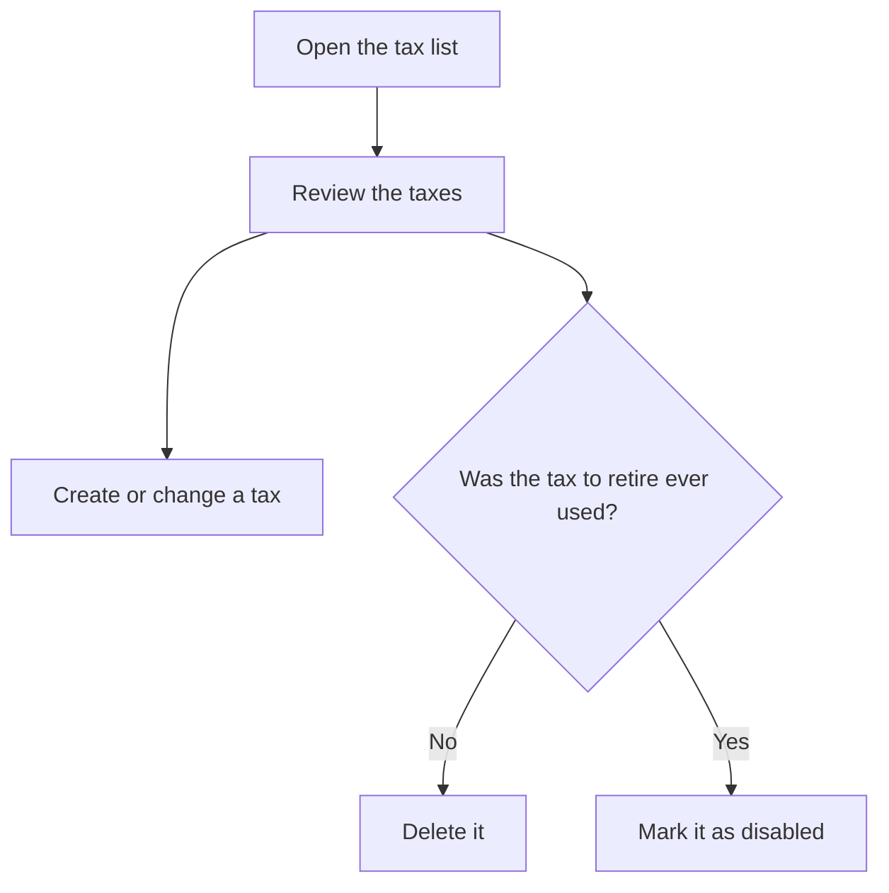

# Taxes

## What this screen is for

Lists the taxes (for example, 21% VAT) applied to sales invoice lines, purchase invoice amounts and references. Each tax has a percentage and can be a reverse charge tax. From here you create new taxes, open them to change them, and delete the ones that have never been used.

## Available actions

- Review the name, "% Percentage", whether it is a "Reverse charge" tax and whether it is "Disabled".
- Create a new tax with the green "+" button ("Create new").
- Open a tax by clicking its row to change it.
- Delete a tax with the trash icon on its row, then confirm.

## Usual flow

1. Open the tax list.
2. Check that the taxes you need exist, at least 21% VAT.
3. Click "+" to create a new one, or open one to change it.
4. Fill in the record and save it; you return to the list with the change applied.
5. To stop using a tax that has already been used, open it and check "Disabled" instead of deleting it.

## Important notes

- Deleting is permanent. A tax assigned to any reference, or already used on sales or purchase invoices, cannot be deleted: to stop using it, mark it "Disabled".
- Disabled taxes are not offered on sales invoice lines or purchase invoice amounts, but they still appear in the "Tax" selector of the reference record.
- When a delivery note is invoiced, each line takes the tax of its reference. If the reference has none, the 21% tax is applied, so one must exist.
- When a purchase invoice is imported from a PDF, taxes are matched by percentage. Avoid having two taxes with the same percentage; if two share a percentage and one is a reverse charge tax, the other one is chosen.
- The list reloads when you come back to it from a tax record.

## Common errors

- If deleting shows "The tax could not be deleted", the tax is in use by a reference or an invoice: disable it instead of deleting it.
- If invoicing a delivery note shows "VAT 21% tax not found", create a tax with percentage 21.
- If a tax does not appear on an invoice, check that it is not marked "Disabled".

## Basic process

