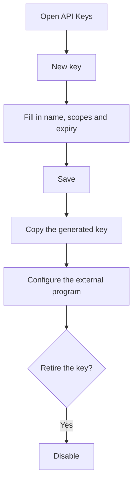

# API Keys

## What this screen is for

This is where you create and disable the keys that other programs (integrations, scripts, external services) use to connect to the ERP without a username and password. Each key is identified by its name and prefix, and it can have an expiry date. The full key is shown only once, when it is created.

## Available actions

- Review the existing keys with their name, description, "Prefix", "Scopes", the "Expires" date and the "Status" ("Active" or "Inactive").
- Create a key with "New key": the "New API Key" dialog opens with "Name", "Description", "Scopes" and "Expiry date", and you save it with "Save".
- Copy the generated key with the copy button in the "API Key generated" dialog.
- Disable a key with the row's "Disable" button and confirm it in the "Disable API Key" message.

## Usual flow

1. Click "New key".
2. Enter a "Name" that clearly identifies who will use the key (for example, the name of the integration) and, if needed, a "Description".
3. Fill in the "Scopes" only if the integration needs them and, if you want the key to expire, pick an "Expiry date".
4. Click "Save".
5. In the "API Key generated" dialog, copy the key and store it somewhere safe.
6. Click "I have saved the key" and configure the key in the external program.
7. When the integration is no longer used, or if the key has leaked, disable it.

## Important notes

- The full key is only visible in the "API Key generated" dialog. The ERP does not store it in plain text: once the dialog is closed, it cannot be viewed again. If it is lost, create a new key and disable the old one.
- The key starts with "rs_" followed by the prefix shown in the "Prefix" column. This lets you tell which key each program uses without seeing the whole key.
- The external program must send the key with every API request, in the "X-Api-Key" header.
- Treat the key like a password. An active key grants access to the API even if it has no scopes.
- Scopes are comma-separated. Currently the only scope the system checks is "branding.write", which allows changing the "Branding". Other scopes are stored but do not restrict access.
- If you leave the expiry date empty, the key never expires (the list shows "Never"). If you set one, the key stops working when that date arrives.
- The "Status" only shows whether the key has been disabled. An expired key still shows as "Active" but can no longer connect: check the "Expires" column too.
- Disabling is final: an "Inactive" key cannot be re-enabled or edited. Keys are never deleted; they stay in the list as "Inactive".
- Once created, a key cannot be changed (not its name, scopes or expiry date). To change anything, create a new key and disable the previous one.

## Common errors

- If "Error creating API key" appears when saving, first check that no key with the same name already exists, even an inactive one: names cannot be repeated.
- If the dialog does not let you save, check that "Name" is filled in ("Name is required").
- If an external program stops connecting, check in the list that its key is not "Inactive" and that its "Expires" date has not passed.
- If you closed the dialog without copying the key, it cannot be recovered: create a new key and disable the one you could not save.

## Basic process

