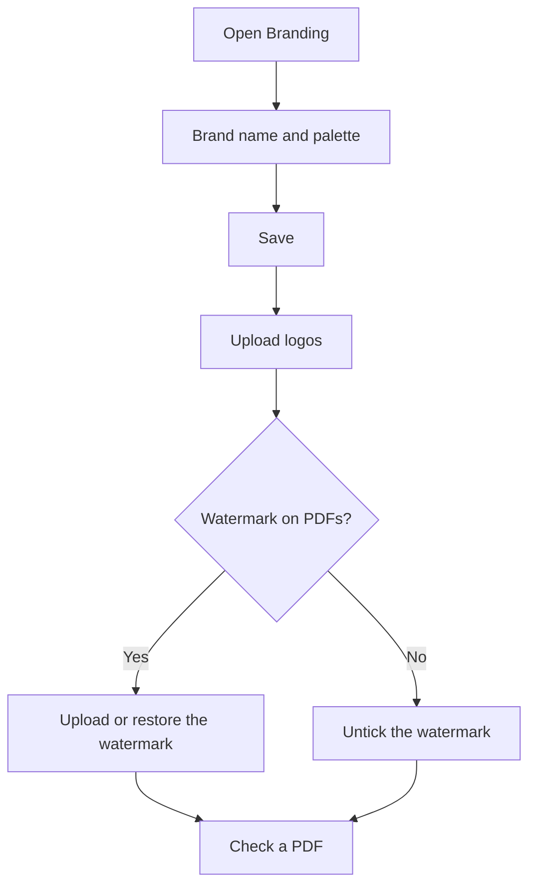

# Branding

## What this screen is for

This is where you set up the company's image in the application and on PDF documents: the brand name, the color palette, the logos and the watermark. Changes affect every user: the sidebar, the login screen, the home screen and the PDFs of budgets, orders, delivery notes, invoices and work orders. Only administrators can make changes; other users see the settings in read-only mode.

## Available actions

- Change the "Brand name" and the "Color palette" (Black, Blue, Indigo, Emerald, Teal, Violet, Orange or Rose) and save them with "Save" in the header.
- Upload the "Main logo" with "Select", or remove it with "Delete".
- Upload the "Sidebar logo" with "Select", or remove it with "Delete".
- Turn "Show the watermark" on or off in the "PDF documents" section.
- Upload your own watermark with "Select", or go back to the built-in one with "Restore default".

## Usual flow

1. Open "Branding".
2. Enter the "Brand name" and choose the "Color palette".
3. Click "Save" in the header.
4. Upload the "Main logo" and, if it does not read well on the dark sidebar background, also upload a "Sidebar logo".
5. In "PDF documents", decide whether to "Show the watermark" and, if needed, upload your own.
6. Generate a PDF (for example, a budget) to check the result.

## Important notes

- Logos and the watermark are saved as soon as you choose the file, and the "Show the watermark" checkbox is saved when you tick or untick it. Only the brand name and the palette need "Save".
- Accepted formats: PNG, JPG/JPEG and WebP, up to 2 MB. The file extension must match its actual content.
- The "Brand name" can be up to 60 characters. If you leave it empty, the default name is used. It appears in the sidebar, the browser tab, the login and home screens, and as the author of the PDFs.
- The palette changes the main color of the whole application (buttons and highlighted elements) and the color accents of the PDFs (title, rules and table headers). You see it immediately; other users see it when they reload the application.
- The "Main logo" appears on the login screen, the home screen and every PDF. Without your own logo, the built-in one is used.
- The "Sidebar logo" is shown on a dark background. If there is none, the sidebar uses the main logo and, failing that, the built-in one.
- The watermark is printed in the center of the page, over the content, on budgets, sales orders, delivery notes, sales invoices and purchase orders. Work orders do not carry it. Use a light PNG with a transparent background so it does not hide the text.
- With "Show the watermark" unticked, PDFs carry no watermark and a new one cannot be uploaded. Ticked and without your own image, the "Default watermark" is printed.
- Replacing or deleting a logo or the watermark removes the previous file from the server and it cannot be recovered. Keep a copy first if you want to preserve it.
- The settings belong to the active company. If more than one company is active in "Companies", the application shows the default image and changes cannot be saved.

## Common errors

- If "You do not have permission to modify Branding." appears, an administrator user is needed to make changes.
- If "Logo cannot exceed 2 MB" appears, reduce the image size; this applies to the watermark too.
- If "Could not update Branding." appears when uploading an image, first check that it is PNG, JPG or WebP and that the extension matches the real format (for example, a PNG renamed to .jpg is rejected).
- If "Could not update Branding." also appears when saving, check in "Companies" that only one company is active.
- If you cannot choose a watermark, tick "Show the watermark" first.
- If another user still sees the old colors, they need to reload the application.

## Basic process

