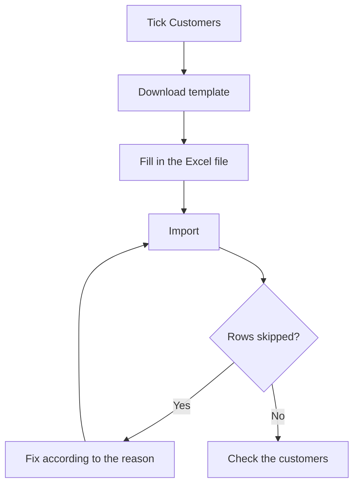

# Data import / export

## What this screen is for

It loads data in bulk from an Excel file, for example when starting to use the ERP with data from a previous program, and exports the existing data to Excel. Right now the only available entity is "Customers", with their addresses and contacts, plus customer types and payment methods. This screen is reserved for administrators.

## Available actions

- Choose the entities under "Available entities", one by one or with "Select all". At least one must be chosen before any action.
- Download an empty Excel file with the columns to fill in with "Download template".
- Upload a filled-in Excel file with "Import".
- Download the existing data to Excel with "Export".
- Review the "Import result": "Total", "Inserted", "Skipped" and the list of rows with problems ("Sheet", "Row", "Code" and "Reason").

## Usual flow

1. Tick "Customers" under "Available entities".
2. Click "Download template". Each column has a comment stating the data type, whether it is required, which other data it refers to and its default value.
3. Fill in the sheets: first any customer types and payment methods that do not exist yet, then the customers, their addresses and contacts.
4. Click "Import" and choose the .xlsx file.
5. Review the "Import result". If rows were skipped, fix them in the file according to the "Reason".
6. Import the file again: rows that were already imported are skipped and only the corrected ones go in.
7. Check the new customers on the customers screen.

## Important notes

- Import only adds new records. It never changes or deletes existing data: if a customer already exists, the row is skipped and the customer in the ERP stays as it is.
- Sheet and column names (in English) must stay exactly as in the template: "Customer", "CustomerAddress", "CustomerContact", "CustomerType" and "PaymentMethod". The "Customer" sheet is required; the others are optional.
- A customer is skipped if its code or commercial name already exists in the ERP or is repeated within the file (case-insensitive).
- For each customer, the code, commercial name, tax name, VAT/tax number, account number and customer type are required. The VAT/tax number must be a valid Spanish NIF, NIE or CIF. The payment method is optional, but if given it must exist. The preferred language defaults to Catalan when left empty.
- Customer types and payment methods are matched by name, among those already in the ERP and those in the "CustomerType" and "PaymentMethod" sheets of the same file.
- Each customer needs at least one address in the "CustomerAddress" sheet. The address marked as main (or, if none is, the first one) must have country, postal code, city and address; otherwise the customer is skipped.
- Addresses and contacts are linked to the customer by code, and are only added to new customers in the same file. A contact can be linked to an address by the address name.
- Yes/no columns accept "true" or "1"; any other value is read as "no". Decimals accept a comma or a dot.
- New customer types and payment methods are saved before the customers: they are created even if some customers are then skipped. Existing ones with the same name are not changed.
- "Skipped" also counts customer type and payment method rows that already existed, even though they do not appear in the list of problems.
- "Export" includes the customers with their active addresses and contacts, plus the active customer types and payment methods, in the same layout as the template.

## Common errors

- If "Select at least one entity." appears, tick "Customers" before clicking the button.
- If the result shows "Missing required sheet Customer", check that the file has a "Customer" sheet with exactly that name.
- If "A customer with code … already exists" or "A customer with commercial name … already exists" appears, the customer is already in the ERP or repeated in the file; change it by hand on the customer record, because import does not update it.
- If "Invalid VAT/Tax number" appears, check the number: it must be a valid Spanish tax ID.
- If "Customer type … does not exist" or "Payment method … does not exist" appears, add it to the matching sheet or check that the name is exactly the same.
- If an address or contact shows "Customer … was not found among the imported customers", first fix that customer's row, which was skipped or is missing from the file.
- If "The main fiscal address of the customer is incomplete" appears, fill in country, postal code, city and address on the main address.
- If "Could not import the file." appears, check that it is a valid .xlsx file. With a large file the import may still have run: check the customers before trying again.

## Basic process

