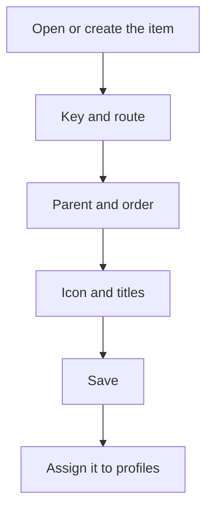

# Menu item

## What this screen is for

This is the record of a side menu item: it can be a group that holds other options, or an option that opens a screen. Here you set the key, the screen it opens, its position in the menu, the icon and the title in each active language. For anyone to see it, you then need to assign it to a profile in "Profiles". This screen is reserved for administrators.

## Available actions

- Fill in the "Key", "Route", "Order" and "Parent" of the item.
- Choose the icon with the picker in the "Icon" field.
- Enter the title in each active language in the "Title (...)" fields, one per language.
- Save with "Save" in the header.

## Usual flow

1. From "Menu Items", open the item or create a new one.
2. Enter a unique "Key" that identifies the item.
3. If it should open a screen, enter its "Route", for example `/users`. If it is a group, leave it empty.
4. Choose the "Parent", that is, the group it belongs to, and the "Order" within that group.
5. Choose the "Icon" and enter the title in every language.
6. Click "Save" and assign the item to profiles in "Profiles".

## Important notes

- The "Key" is required and cannot be repeated in any other item.
- A title is required for each active language. If the languages could not be loaded, the message "Active languages could not be loaded" appears and the item cannot be saved.
- Each user sees the title in their own language.
- The "Order" is required, cannot be negative and sets the position within the group, from lowest to highest.
- If you choose no "Parent", the item appears at the top level of the menu. In the parent list, each level is marked with ">".
- The "Parent" cannot be the item itself or any item that sits below it.
- Changes show in the side menu when the page is reloaded, and only for users whose profile has the item assigned.

## Common errors

- If saving reports that the menu item key already exists, change the "Key" to one that no other item uses.
- If "Title is required" or "A title is required for every active language" appears, fill in all the "Title (...)" fields.
- If the changes are not there when you reopen the item, first check that no other item uses the same "Key" and that the "Parent" is not an item that sits below this one.
- If the item does not appear in the menu, check that it is assigned to the profile of the user in "Profiles" and reload the page.

## Basic process

