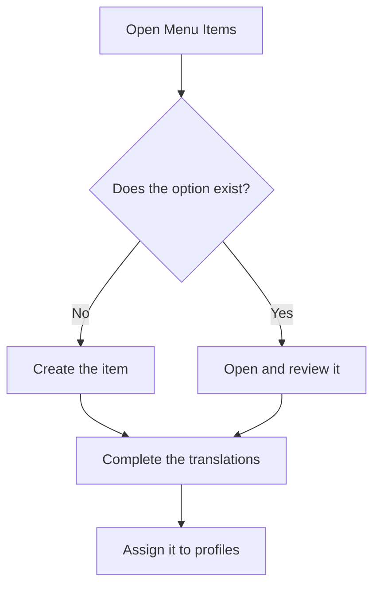

# Menu Items

## What this screen is for

This is where the side menu of the application is defined: the groups, the options in each group, their order, icon, the screen they open and their title in each language. Nobody sees the items created here until they are assigned to a profile in "Profiles". This screen is reserved for administrators.

## Available actions

- Browse the items as a tree, with the "Title", "Key", "Route", "Order" and "Icon" columns. The arrow on each group shows or hides its children.
- Search with the "Search" field, which filters by title and key and keeps visible the groups that contain a match. The "Clear filters" button clears the search.
- Create an item with the green "+" button (tooltip "Create new").
- Open an item by clicking its row or with the pencil button in the "Actions" column.
- Delete an item with the trash button. The application asks for confirmation: "Delete menu item?".
- Translate the titles of all items at once with the "Translate menus" button.
- Export all items to a JSON file with "Export menus", and load one with "Import menus".

## Usual flow

1. Search to see whether the option you need already exists.
2. If not, click "+" and create the item inside the right group.
3. Check in the tree that it appears in the right place and order.
4. If needed, complete the translations with "Translate menus".
5. Assign the item to the profiles that should see it in "Profiles".

## Important notes

- The "Order" column sets the order within each group, from lowest to highest.
- An item that has children cannot be deleted: first delete its children or move them to another parent.
- Deletion is permanent and removes the item from every profile that had it.
- "Translate menus" shows one row per item and one column per active language. "Save" is only enabled when there are changes and no modified title has been left empty. If you click "Cancel" with pending changes, the application asks whether to discard them.
- Exporting produces a file with all items, their parents, icons, routes, order and titles. It is useful, for example, to copy the menu to another installation.
- When importing, items are matched by "Key": new keys are created and existing ones are updated. Items missing from the file are not deleted, and profile assignments do not change.
- Importing is all or nothing: if the file has any error, no change is applied. The file can be at most 5 MB.
- After an import, your own side menu refreshes by itself. Other changes show in the menu when the page is reloaded.

## Common errors

- If an item still appears in the tree after deleting it, first check whether it has child items.
- If exporting fails because the translations of an item do not match the active languages, complete its titles with "Translate menus" and try again.
- If importing reports that the file does not contain a valid JSON document, use a file produced by "Export menus".
- If importing reports that an item has a missing or invalid parent key, add the parent to the same file or remove the parent from the item.
- If importing reports that translations do not match the active languages, check that every item has a title for every active language.

## Basic process

