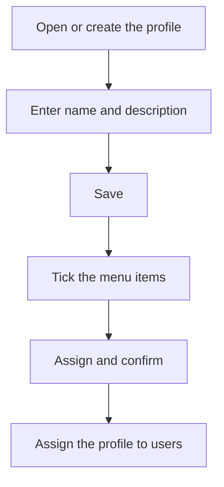

# Profile

## What this screen is for

This is the record of a profile. At the top are the profile's name and description; below is the list of every menu item in the application, where you tick the ones that users with this profile should see. Menu items are defined in "Menu Items", and the profile is assigned to each user in "User management". This screen is reserved for administrators.

## Available actions

- Enter or change the profile's "Name" (required) and "Description" and save them with "Save" in the header.
- Search menu items with the "Search" field, which filters by title and key.
- Tick or untick menu items with each row's checkbox, or all at once with the checkbox in the list header.
- Save the menu selection with "Assign". The application asks for confirmation: "Confirm saving menu selection?".

## Usual flow

1. From "Profiles", open the profile or create a new one.
2. If it is new, enter the "Name" and "Description" and click "Save".
3. In the menu list, tick the groups and options this profile should see. Use "Search" to find them faster.
4. Click "Assign" and confirm.
5. Assign the profile to users in "User management".

## Important notes

- The list shows menu items as a tree: each level is further indented. The columns are "Title", "Key", "Route" and "Order".
- Ticking an item also ticks all its children and all the items above it. Unticking it unticks its children and any items above it that no longer have a ticked child.
- The menu selection is not saved with "Save": you must click "Assign". And "Assign" does not save the name or description.
- Save the profile first, then assign its menus.
- If you are editing your own profile, your side menu refreshes when you save the selection. Other users with this profile see the change when they reload the page or sign in again.
- For a system profile, the "Name" and the "System" checkbox cannot be changed.
- The "System" checkbox is not saved from this screen: ticking it does not turn the profile into a system profile.
- New menu items are not added to any profile automatically: you have to tick them here.

## Common errors

- If "Assign" shows "Error" on a new profile, first check that the profile has been saved: go back to "Profiles", open it from the list and assign the menus again.
- If "Error" appears when saving a new profile, go back to "Profiles" and check whether the profile is already there before creating it again.
- If a warning about an existing profile name appears, choose a name that no other profile uses.
- If a user cannot see an option they should, check that the item is ticked in their profile and that the user has that profile assigned.

## Basic process

